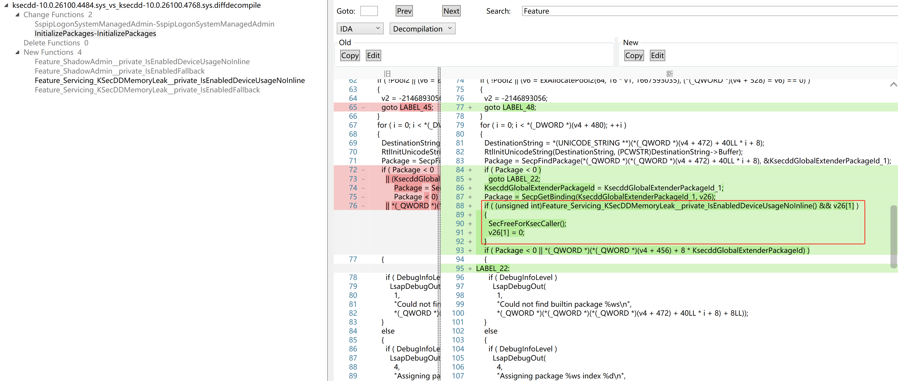

2025-07-29 补丁更新分析  ksecdd 10.0.26100.4484 - 10.0.26100.4768
添加了两对 Feature, 这里我们关注 Feature_Servicing_KSecDDMemoryLeak 




根据decompilation  补丁函数是 InitializePackages
经过分析 CreateClient调用  InitializePackages

1. 调用 PsGetProcessSecurityPort 获取eprocess  SecurityPort 字段，等于1表明进程正在终止状态
2. CreateClient函数第二个参数表明是否 同步Lsass  \\SECURITY\\LSA_AUTHENTICATION_INITIALIZEevent
3. 核心函数 CreateRpcConnection  内核使用lsass  endpoint   lsasspirpc创建连接
4. KsecAddRpcConnection 添加rpc 连接
5. 调用 InitializePackages

v26是个栈上的指针数组，大小是24， 调用SecpGetBinding函数会对 v26[1] 指针赋值，10.0.26100.4484没有对这部分内存在 binding完成后进行释放，造成内存泄露


向上回溯触发链，ksecdd  KsecDispatch  ioctl 0x398000 调用 CreateClient
```c
__int64 __fastcall KsecDispatch(__int64 a1, __int64 Irp)
{
    ...
    case 0x398000:
        KsecddLsaStateRef::KsecddLsaStateRef((KsecddLsaStateRef *)&v31);
      if ( KsecddLsaStateRef::IsValid((KsecddLsaStateRef *)&v31) )
      {
        v26 = (PVOID *)KsecddLsaStateRef::operator _KSECDDLSASTATE *(&v31);
        if ( *v26 )
        {
          KsecddLsaStateRef::~KsecddLsaStateRef((KsecddLsaStateRef *)&v31);
          status = NDIS_STATUS_NOT_SUPPORTED;
        }
        else if ( v7 && n4_1 >= 4 )
        {
          CurrentProcess = (void *)PsGetCurrentProcess();
          *v26 = CurrentProcess;
          ObfReferenceObject(CurrentProcess);
          status = CreateClient(1, 1);			// [here]
          if ( status >= 0 )
          {
            Client_1 = ObOpenObjectByPointer(*v26, 0x200u, 0, 1144, 0, 0, v26 + 1);
            if ( Client_1 >= 0 )
            {
              *v7 = KsecSystemProcessId;
              n4 = 4;
            }
            KsecddLsaStateRef::~KsecddLsaStateRef((KsecddLsaStateRef *)&v31);
            goto LABEL_16;
          }
          KsecddLsaStateRef::~KsecddLsaStateRef((KsecddLsaStateRef *)&v31);
        }
        else
        {
          KsecddLsaStateRef::~KsecddLsaStateRef((KsecddLsaStateRef *)&v31);
          status = STATUS_BUFFER_TOO_SMALL;
        }
    ...
}
```
## poc
现在我们大致写出能够触发的伪代码
```c
CreateFile("\Device\Ksecdd")
DeviceIoControl(file,0x398000)
调试观察内存情况
```

## reference
● https://www.unknowncheats.me/forum/4352316-post1.html     
● https://blog.scrt.ch/2024/11/11/exploiting-ksecdd-through-server-silos/   
● https://github.com/scrt/KexecDDPlus   
● https://github.com/floesen/KExecDD/   
● https://tierzerosecurity.co.nz/2024/04/29/kexecdd.html    