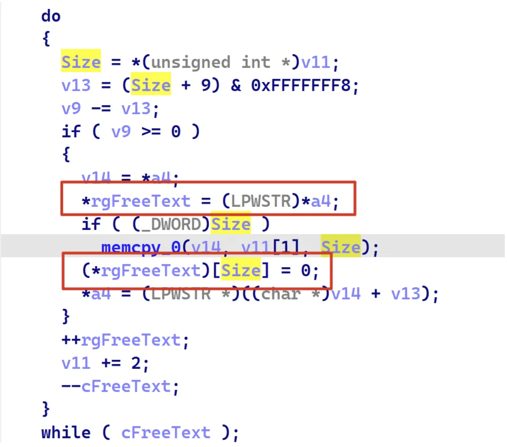
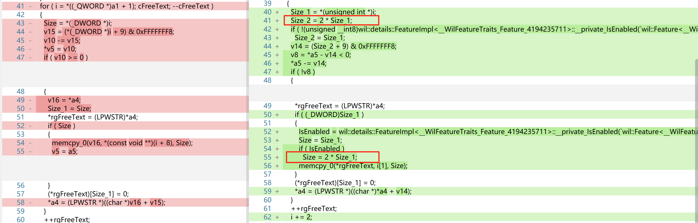

## root cause

问题在于 `crypt32!Asn1X509GetPKIFreeText` 类型不匹配

a4 强制类型转换  宽字节类型 rgFreeText，后续拷贝内存时 Size没有使用对应的大小




## diff

```
crypt32-10.0.22621.3575.dll_vs_crypt32-10.0.22621.3640.dll.diffdecompile
```

[diffdecompile](https://github.com/bopin2020/diffdecompile/blob/main/data/win11-22h2/2024-05/crypt32-10.0.22621.3575.dll_vs_crypt32-10.0.22621.3640.dll.diffdecompile)

win11 22h2   2024-05 

微软给的漏洞类型是 堆溢出，根据补丁能够发现将 memcpy调用的第三个参数 变为宽字节大小，即原来的两倍。

那么之前即时存在漏洞，memcpy只能说明拷贝的数据大小不足，为什么 CVE-2024-30020 漏洞类型是堆溢出呢？



仔细分析补丁会发现在 下面有一个地址引用赋值操作, 既然memcpy拷贝内存到 *tgFreeText 数据长度不足，

那么正常来说 `(*rgFreeText)[Size_1]` 会发生越界，正常截断应该是 `(*rgFreeText)[Size_1 - 1]`

因为Size_1 等于 Size 就会导致出现问题。


## reference

*  https://v-v.space/2024/08/23/CVE-2024-29050/	
* https://msrc.microsoft.com/update-guide/vulnerability/CVE-2024-30020   
* https://cfp.recon.cx/media/recon2024/submissions/SB3QLK/resources/Tales_From_The_Crypt_-_Egsgard_-_RECon_2024_COxZmIb.pdf   