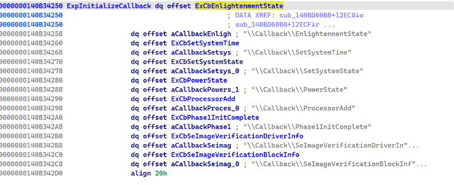
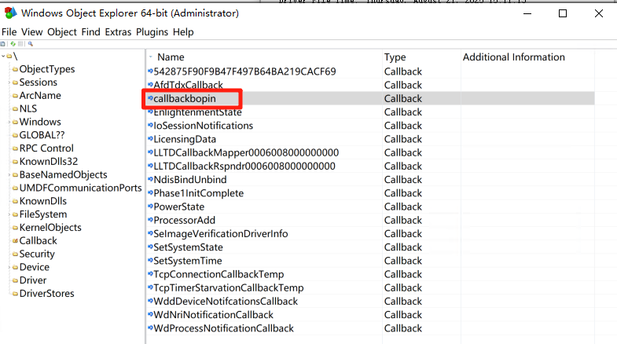
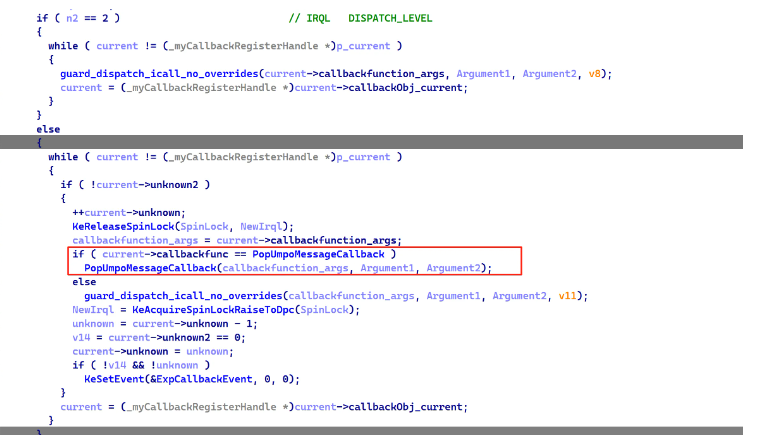

本节学习下内核提供的  Callback mechanism

- Callback 机制和如何使用API 来创建Callback对象
- 逆向内核，审计实现原理
- 调试 系统开机创建的Callback


## Metadata

当某些特定条件发生时，内核为驱动提供了通知机制

动机： 事件通知机制 监控系统内某一事件的操作

   回调机制： 反映系统内某一个部件的状态 也可以实现多个内核模块之间的通信


内核支持  `Callback`对象， 并且提供了一套API 用来创建Callback，注册， Notify

```plain
ExCreateCallback
ExRegisterCallback
ExUnregisterCallback
ExNotifyCallback
```

内核提供了以下Callback  `nt!ExpInitializeCallback`




## example

```python
内核创建Callback,注册指定回调例程,Callback机制支持注册多个callback

1. ExCreateCallback()

2. ExRegisterCallback(CallbackRoutine)

3. ExUnregisterCallback()

其他调用者 打开Callback, NotifyCallback， 从而触发注册时指定的回调例程
1. ExCreateCallback()

2. ExNotifyCallback()
```

common.h

```python
#include <ntddk.h>

/*
reference from https://geeknote.net/tiancai/posts/2010

*/

#define CALLBACK_NAME L"\\Callback\\callbackbopin"

#define KPrint(x) DbgPrintEx(0, 0, x)

NTSTATUS DriverEntry(PDRIVER_OBJECT DriverObject, PUNICODE_STRING RegistryPath);

NTSTATUS UnloadDriver(PDRIVER_OBJECT DriverObject);

VOID CALLBACK_ROUTINE(PVOID CallbackContext,PVOID Argument1,PVOID Argument2);

typedef struct _Context{
	PCALLBACK_OBJECT CallbackObject;
	BOOLEAN Init;
	PVOID Cookie;
}Context;
```

Driver.cpp

```python
#include "common.h"

Context ctx = {0};

NTSTATUS DriverEntry(PDRIVER_OBJECT DriverObject, PUNICODE_STRING RegistryPath)
{
	DriverObject->DriverUnload = (PDRIVER_UNLOAD)UnloadDriver;

	NTSTATUS status = 0;
	UNICODE_STRING uniName = RTL_CONSTANT_STRING(CALLBACK_NAME);
	OBJECT_ATTRIBUTES objAttri;
    // 没有指定 OBJ_PERMANENT时不会创建永久性对象
	InitializeObjectAttributes(&objAttri, &uniName, OBJ_CASE_INSENSITIVE | OBJ_PERMANENT, NULL, NULL);

	status = ExCreateCallback(&ctx.CallbackObject,&objAttri,TRUE,FALSE);
	if(!NT_SUCCESS(status)){
        KdPrint(("[notifycallback] ExCreateCallback error code:(0x%x).\n", status));
        return status;
	}

	ctx.Cookie = ExRegisterCallback(ctx.CallbackObject,CALLBACK_ROUTINE,NULL);
	if(ctx.Cookie == NULL){
		KdPrint(("[notifycallback] ExRegisterCallback \n"));
        return status;
	}
	ctx.Init = TRUE;
	status = STATUS_SUCCESS;

	KdPrint(("[notifycallback] succ\n"));
	return status;
}

NTSTATUS UnloadDriver(PDRIVER_OBJECT DriverObject)
{
	if(ctx.Cookie != NULL){
		ExUnregisterCallback(ctx.Cookie);
	}
	KdPrint(("[notifycallback] unload...\n"));
	return STATUS_SUCCESS;
}

VOID CALLBACK_ROUTINE(PVOID CallbackContext,PVOID Argument1,PVOID Argument2){
	KdPrint(("notify callback is triggered! \n",0));
}
```

> note: 创建命名内核对象时，如果没有指定 `OBJ_PERMANENT`就不会在 winobj 对象管理器中查看到，这是因为`ObCreateObjectEx`对象管理器在创建对象时会检查 `SeCreatePermanentPrivilege`特权，之后我们就可以看到了




## internals

现在我们看看具体实现
nt: win11 24h2 26100.4946
逆向内核发现以下Callback实现

```python
ExCreateCallback
ExRegisterCallback
ExungisterCallback
ExNotifyCallback

ExpInitializeCallbacks

// 变量
ExpCallbackListHead
```


`ExpInitializeCallbacks` 初始化对象管理器 Callback目录, 由`ExpInitSystemPhase1`第1阶段内核执行，其基本算法如下：

1. 初始化 ExpCallbackListLock 锁变量为null, 设置链表头 ExpCallbackListHead变量; 初始化 `Callback`字符串
2. `ObCreateObjectType`函数创建 `ExCallbackObjectType`内核对象类型  [ObCreateObjectType 用法](https://leguanyuan.blogspot.com/2016/08/obcreateobjecttypexpwin10.html)  还可以参考 [ObjectManager](https://www.i.u-tokyo.ac.jp/edu/training/ss/msprojects/data/04-ObjectManagerLPC.pdf)  对象管理器是如何设计和创建内核对象的. 此外 [@zodiacon](https://x.com/zodiacon) 曾经写过两篇文章如何创建内核对象的  [here](https://github.com/zodiacon/KObjects)
3. 设置对象管理器目录名称 `\\Callback`并设置安全描述符为  `SePublicDefaultSd` 默认安全描述符由 `SePublicDefaultDacl`设置，后者初始化了三对ACE  `SeWorldSid  SeLocalSystemSid  SeAliasAdminsSid` 这里不对访问控制细节展开 可自行审计 `SepInitSystemDacls`
4. 通过系统调回 `NtCreateDirectoryObject`创建 `\\Callback`目录
5. 内核 `ExpInitializeCallback`数组变量内置Callback 迭代调用 `ExCreateCallback`创建Callback


`ExCreateCallback` 创建`ExCallbackObjectType`对象的基本逻辑是：

1. Callback命名对象名称不为空  `ObOpenObjectByNameEx`对象管理器函数尝试打开对象成功后调用`ObReferenceObjectByHandle` 获取`CALLBACK_OBJECT`对象指针（不透明结构）
2. 参数指定了创建  `ObCreateObjectEx`创建 `ExCallbackObjectType`类型的**内核对象**  对象前四字节magic 为 0x6C6C6143 `Call`
3. `CALLBACK_OBJECT`0x20 存储一字节表示是否支持  `AllowMultipeCallbacks`
4.  `ExpLockCallbackListExclusive` 线程保护，然后初始化 `ExpCallbackListHead`链表最后 `ExpUnlockCallbackListExclusive`退出保护
5. 调用 `ObInsertObjectEx`将callback对象插入到对象管理器中


```c
// unknown size  we should check Object Manager how to create callback type object
typedef struct _myCALLBACK_OBJECT{
//0x10
    int Magic;		// 'Call'
    int padding;
    PKSPIN_LOCK KSPIN_LOCK;	// equals 0    ExRegisterCallback 会用到
//0x10
    _myCallbackRegisterHandle* current;	// 存储 CALLBACK_OBJECT对象 0x10的内核地址
    _myCallbackRegisterHandle* next;// 存储 CALLBACK_OBJECT对象 0x10的内核地址 主要是为了支持一个CallbackObject 允许多个callback functions
//0x20
    BOOL AllowMultipeCallbacks;
//0x28
    void* ExpCallbackListHead;	// 存储callback链表头地址
//0x30
    void* ExpCallbackListHeadAddr; // 存储callback链表头地址 二级指针
}myCALLBACK_OBJECT;
```


`ExRegisterCallback`函数为 `CALLBACK_OBJECT`对象注册回调例程, 其基本算法：

1. `ExRegisterCallback`返回 callback register handle指针，首先分配0x30 非分页内存
2. 初始化 `_myCallbackRegisterHandle`回调对象，回调例程和上下文参数
3. `KeAcquireSpinLockRaiseToDpc` 初始化回调对象中的spin lock
4. 判断回调对象是否支持 AllowMultipeCallbacks  设置_myCallbackRegisterHandle 当前回调对象和下一个回调对象
5. `KeReleaseSpinLock` 释放spin lock


```c
// 0x30 non-paged
typedef struct _myCallbackRegisterHandle{
//0x0
    _myCALLBACK_OBJECT* callbackObj_current;
    _myCALLBACK_OBJECT* callbackObj_next;
//0x10
    _myCALLBACK_OBJECT* callbackObj;		// 回调对象
    void*	callbackfunc;				// 回调例程
//0x20
    void* callbackfunction_args;		// 回调例程的上下文参数
    int unknown;
//0x2c
    char unknown2;
    char unknown3;
    char unknown4;
    char unknown5;
}myCallbackRegisterHandle;
```


`ExUnregisterCallback`call register handle 的逻辑就非常简单，释放`_myCallbackRegisterHandle`分配的内存


`ExNotifyCallback` 根据`_myCALLBACK_OBJECT`回调对象获取 `_myCallbackRegisterHandle`指针，执行其中的回调例程, 其算法如下

1. 获取回调对象中的 current  registerhandle对象指针
2. 获取回调对象中 spin lock 进入保护
3. 检查当前IRQL 处于DISPATCH_LEVEL  屏蔽了线程上下文切换，迭代执行回调例程
4. IRQL 不等于2时，检查回调例程是否是电源相关 是执行 `PopUmpoMessageCallback`, 否则迭代链表 执行回调例程




现在我们重新整理下内核有关Callback的创建，注册和回调例程

默认情况下回调对象都支持 multi callbacks， 不支持 使用 【x】 标识

| Callback Name                             | Description                         | caller function                                 | 回调例程                                                     |
| ----------------------------------------- | ----------------------------------- | ----------------------------------------------- | ------------------------------------------------------------ |
| \\Callback\\EnlightenmentState            |                                     | ExpInitializeCallbacks                          | ExCbEnlightenmentState                                       |
| \\Callback\\SetSystemTime                 | 当系统时间改变时 执行回调           | ExpInitializeCallbacks                          | ExCbSetSystemTime                                            |
| \\Callback\\SetSystemState                |                                     | ExpInitializeCallbacks                          | ExCbSetSystemState                                           |
| \\Callback\\Phase1InitComplete            |                                     | ExpInitializeCallbacks                          | ExCbPhase1InitComplete                                       |
| \\Callback\\SeImageVerificationDriverInfo |                                     | ExpInitializeCallbacks                          | ExCbSeImageVerificationDriverInfo                            |
| \\Callback\\SeImageVerificationBlockInfo  |                                     | ExpInitializeCallbacks                          | ExCbSeImageVerificationBlockInfo                             |
|                                           |                                     |                                                 |                                                              |
| \\Callback\\PowerState                    | 电源状态发生改变时 执行回调例程     | ExpInitializeCallbacksHvlPhase2Initialize       | ExCbPowerStateHvlpPowerStateCallback                         |
|                                           |                                     | HaliInitPowerManagement                         |                                                              |
| \\Callback\\SoftRestart                   |                                     | HalpMiscInitializeKsrxxEtwpInitializeKsrSupport | HalpKsrCallbackRoutinePipKsrCallbackPopKsrCallbackEtwpKsrCallback |
| \\Callback\\BootDriver                    |                                     | IoRegisterBootDriverCallback                    |                                                              |
| \\Callback\\ProcessorAdd                  | 动态添加CPU时触发（集群服务器场景） | KeRegisterProcessorChangeCallback               | ExCbProcessorAddPopNewProcessorCallback                      |
| \\Callback\\LicensingData                 |                                     | ExInitLicenseCallback                           |                                                              |
| \\Callback\\IoSessionNotifications        | **NtNotifyChangeSession** 可触发    | IopInitializeSessionNotifications               | IopDispatchSessionNotifications                              |
| \\Callback\\IoExternalDmaUnblock          | **NtPowerInformation** 可触发       | PiCslInitialize                                 | PipCslStateChangeCallback                                    |
| \\Callback\\PowerPort     【x】           |                                     | PopUmpoInitializeChannel                        | PopUmpoMessageCallback                                       |
| \\Callback\\PowerMonitorPort              |                                     | PopUmpoInitializeMonitorChannel                 | PopMonitorAlpcCallback                                       |
| \\Callback\\SleepstudyControlPort         |                                     | SshpAlpcInitialize                              | SshpAlpcMessageCallback                                      |
|                                           |                                     |                                                 |                                                              |


当我们使用调试器在系统初始化追踪时会发现以下 Callback创建和访问

bp nt!ExCreateCallback "dt nt!_OBJECT_ATTRIBUTES @rdx -y ObjectName;g"

```python
   +0x010 ObjectName : 0xffffef83`5e406770 _UNICODE_STRING "\Callback\EnlightenmentState"
   +0x010 ObjectName : 0xffffef83`5e406770 _UNICODE_STRING "\Callback\SetSystemTime"
   +0x010 ObjectName : 0xffffef83`5e406770 _UNICODE_STRING "\Callback\SetSystemState"
   +0x010 ObjectName : 0xffffef83`5e406770 _UNICODE_STRING "\Callback\PowerState"
   +0x010 ObjectName : 0xffffef83`5e406770 _UNICODE_STRING "\Callback\ProcessorAdd"
   +0x010 ObjectName : 0xffffef83`5e406770 _UNICODE_STRING "\Callback\Phase1InitComplete"
   +0x010 ObjectName : 0xffffef83`5e406770 _UNICODE_STRING "\Callback\SeImageVerificationDriverInfo"
   +0x010 ObjectName : 0xffffef83`5e4067d8 _UNICODE_STRING "\Callback\PowerState"
   +0x010 ObjectName : 0xfffff802`59073d50 _UNICODE_STRING "\Callback\LicensingData"
   +0x010 ObjectName : (null) 
   +0x010 ObjectName : (null) 
   +0x010 ObjectName : (null) 
   +0x010 ObjectName : 0xffffef83`5e406a10 _UNICODE_STRING "\Callback\IoSessionNotifications"
   +0x010 ObjectName : 0xffffef83`5e4067d0 _UNICODE_STRING "\Callback\IoExternalDmaUnblock"
   +0x010 ObjectName : 0xfffff802`5c913000 _UNICODE_STRING "\Callback\542875F90F9B47F497B64BA219CACF69"
   +0x010 ObjectName : 0xffffef83`5e406520 _UNICODE_STRING "\Callback\AcpiSimulator"
   +0x010 ObjectName : 0xffffef83`5e4064e0 _UNICODE_STRING "\Callback\PowerState"
   +0x010 ObjectName : 0xffffef83`5e4060c0 _UNICODE_STRING "\Callback\ProcessorAdd"
   +0x010 ObjectName : 0xffffef83`5e4061c0 _UNICODE_STRING "\Callback\PowerState"
   +0x010 ObjectName : 0xffffef83`5e406650 _UNICODE_STRING "\Callback\PowerState"
   +0x010 ObjectName : 0xffffef83`5e4064e0 _UNICODE_STRING "\Callback\IoExternalDmaUnblock"
   +0x010 ObjectName : 0xffffef83`5e405c60 _UNICODE_STRING "\Callback\PowerState"
   +0x010 ObjectName : 0xffffef83`5e405ce0 _UNICODE_STRING "\Callback\PowerState"
   +0x010 ObjectName : (null) 
Unable to load image vmci.sys, Win32 error 0n2
   +0x010 ObjectName : 0xffffef83`5e406578 _UNICODE_STRING "\Callback\VMCIDetachCB"
   +0x010 ObjectName : 0xffffef83`5e406490 _UNICODE_STRING "\Callback\WdProcessNotificationCallback"
   +0x010 ObjectName : 0xffffef83`5e406490 _UNICODE_STRING "\Callback\WdNriNotificationCallback"
   +0x010 ObjectName : 0xffffef83`5e4065f0 _UNICODE_STRING "\CallBack\NdisBindUnbind"
   +0x010 ObjectName : 0xffffef83`5e4064a0 _UNICODE_STRING "\Callback\ProcessorAdd"
   +0x010 ObjectName : 0xffffef83`5e4064b0 _UNICODE_STRING "\Callback\ProcessorAdd"
   +0x010 ObjectName : 0xffffef83`5e4063d0 _UNICODE_STRING "\Callback\TcpConnectionCallbackTemp"
   +0x010 ObjectName : 0xffffef83`5e4063d0 _UNICODE_STRING "\Callback\TcpTimerStarvationCallbackTemp"
   +0x010 ObjectName : 0xffffef83`5e406470 _UNICODE_STRING "\Callback\PowerState"
   +0x010 ObjectName : 0xffffef83`5e406920 _UNICODE_STRING "\Callback\ProcessorAdd"
KDTARGET: Refreshing KD connection
   +0x010 ObjectName : 0xffffef83`5e406780 _UNICODE_STRING "\Callback\AfdTdxCallback"
   +0x010 ObjectName : 0xffffef83`5e406730 _UNICODE_STRING "\Callback\LicensingData"
DriverEntry failed 0xc00000bb for driver \REGISTRY\MACHINE\SYSTEM\ControlSet001\Services\vmbusr
   +0x010 ObjectName : 0xffffef83`5e8e5c60 _UNICODE_STRING "\Callback\PowerState"
   +0x010 ObjectName : 0xffffef83`5e8e5d80 _UNICODE_STRING "\Callback\PowerState"
   +0x010 ObjectName : 0xffffef83`5e8e5c50 _UNICODE_STRING "\Callback\PowerState"
   +0x010 ObjectName : 0xffffef83`5e8e5c10 _UNICODE_STRING "\Callback\PowerState"
   +0x010 ObjectName : 0xffffef83`5e8e5ad0 _UNICODE_STRING "\Callback\PowerState"
   +0x010 ObjectName : 0xffffef83`5e8e5ad0 _UNICODE_STRING "\Callback\PowerState"
   +0x010 ObjectName : 0xffffef83`5e8e5ad0 _UNICODE_STRING "\Callback\PowerState"
   +0x010 ObjectName : 0xffffef83`5e8e5c30 _UNICODE_STRING "\Callback\PowerState"
   +0x010 ObjectName : 0xffffef83`5e8e5d20 _UNICODE_STRING "\Callback\PowerState"
   +0x010 ObjectName : 0xffffef83`5e8e5d20 _UNICODE_STRING "\Callback\PowerState"
   +0x010 ObjectName : 0xffffef83`5e8e5d20 _UNICODE_STRING "\Callback\PowerState"
   +0x010 ObjectName : 0xffffef83`5e8e5d20 _UNICODE_STRING "\Callback\PowerState"
   +0x010 ObjectName : 0xffffef83`5e8e5d20 _UNICODE_STRING "\Callback\PowerState"
   +0x010 ObjectName : 0xffffef83`5e8e5d20 _UNICODE_STRING "\Callback\PowerState"
   +0x010 ObjectName : 0xffffef83`5e8e5d20 _UNICODE_STRING "\Callback\PowerState"
   +0x010 ObjectName : 0xffffef83`5e8e5d20 _UNICODE_STRING "\Callback\PowerState"
   +0x010 ObjectName : 0xffffef83`5e8e5c50 _UNICODE_STRING "\Callback\PowerState"
   +0x010 ObjectName : 0xffffef83`5e8e5dc0 _UNICODE_STRING "\Callback\PowerState"
   +0x010 ObjectName : 0xffffef83`5e8e5d90 _UNICODE_STRING "\Callback\PowerState"
   +0x010 ObjectName : 0xffffef83`5e8e5c00 _UNICODE_STRING "\Callback\PowerState"
   +0x010 ObjectName : 0xffffef83`5e8e5d30 _UNICODE_STRING "\Callback\PowerState"
   +0x010 ObjectName : 0xffffef83`5e4dcc40 _UNICODE_STRING "\Callback\PowerState"
   +0x010 ObjectName : 0xfffff802`5cbea0a0 _UNICODE_STRING "\Callback\DamExemptCheckCallback"
   +0x010 ObjectName : (null) 
   +0x010 ObjectName : 0xffffef83`5e50df28 _UNICODE_STRING "\Callback\LLTDCallbackMapper0006008002000000"
   +0x010 ObjectName : 0xffffef83`5e50df28 _UNICODE_STRING "\Callback\LLTDCallbackRspndr0006008002000000"
   +0x010 ObjectName : 0xffffef83`5e902630 _UNICODE_STRING "\Callback\ProcessorAdd"
   +0x010 ObjectName : 0xffffef83`5e5d8f28 _UNICODE_STRING "\Callback\LLTDCallbackMapper0006008001000000"
   +0x010 ObjectName : 0xffffef83`5e5d8f28 _UNICODE_STRING "\Callback\LLTDCallbackRspndr0006008001000000"
   +0x010 ObjectName : 0xffffef83`5e4dcf28 _UNICODE_STRING "\Callback\LLTDCallbackMapper0006008007000000"
   +0x010 ObjectName : 0xffffef83`5e4dcf28 _UNICODE_STRING "\Callback\LLTDCallbackRspndr0006008007000000"
   +0x010 ObjectName : 0xffffef83`5e902680 _UNICODE_STRING "\Callback\ProcessorAdd"
Unable to load image vsock.sys, Win32 error 0n2
   +0x010 ObjectName : 0xffffef83`5edf80a8 _UNICODE_STRING "\Callback\VMCIDetachCB"
   +0x010 ObjectName : 0xffffef83`5e901c40 _UNICODE_STRING "\Callback\PowerState"
Unable to load image vmhgfs.sys, Win32 error 0n2
   +0x010 ObjectName : 0xffffef83`6066f1f8 _UNICODE_STRING "\Callback\VMCIDetachCB"
   +0x010 ObjectName : 0xffffef83`5ead3f28 _UNICODE_STRING "\Callback\LLTDCallbackMapper0006008007000000"
   +0x010 ObjectName : 0xffffef83`5ead3f28 _UNICODE_STRING "\Callback\LLTDCallbackRspndr0006008007000000"
   +0x010 ObjectName : 0xfffff802`5cbea0a0 _UNICODE_STRING "\Callback\DamExemptCheckCallback"
   +0x010 ObjectName : 0xffffef83`60fe2570 _UNICODE_STRING "\Callback\WdNriNotificationCallback"
   +0x010 ObjectName : 0xffffef83`60fe2570 _UNICODE_STRING "\Callback\WdProcessNotificationCallback"
```


## reference

- https://learn.microsoft.com/en-us/windows-hardware/drivers/ddi/wdm/nf-wdm-excreatecallback
- https://learn.microsoft.com/en-us/windows-hardware/drivers/kernel/callback-objects
- https://learn.microsoft.com/en-us/windows-hardware/drivers/kernel/defining-a-callback-object
- https://geeknote.net/tiancai/posts/2010   Callback  multi drivers communication
