最近IDA又开始活动了。推出了ida_domain [here1](https://x.com/HexRaysSA/status/1986202503776772536) [ida-domain](https://github.com/HexRaysSA/ida-domain) python package 对以往IDAPython进行重构并且idalib  headless支持也更舒服。想起之前还留有许多坑没有填完，就有了此文。

笔者回答了以下几个问题：

1. IDA 反编译尤其是ida_domain 支持并发反编译函数吗？
2. ida_domain 对headless支持有何改进？比起9.0 idacli.py 使用体验如何
3. ida_domain 执行ida 脚本时是否存在基于policy方式对插件进行禁用，最小化运行插件所需的资源

从反编译Internals 意义上讲，本文并没有涉及这些知识。感兴趣的可以参考  [elastic hexrays decompilation internals](https://www.elastic.co/security-labs/introduction-to-hexrays-decompilation-internals) 和 [hexrays decompiler primer](https://hex-rays.com/blog/hex-rays-decompiler-primer)   对于IDA底层microcode 从设计上可以参考 [@iIfak](https://x.com/ilfak) 在2018年Black Hat上的分享  [Decompiler internals: microcode](https://www.blackhat.com/us-18/speakers/Ilfak-Guilfanov.html)  笔者也托管在了当前域可以在线浏览  [here](https://bopin.me/pdf/Ilfak-Guilfanov-IDA%20Decompile%20Internal-2018-BlackHat.pdf)


## Concurrency whether support for hexrays decompiling?

ida-domain的反编译接口  `Database.functions.get_pseudocode` 

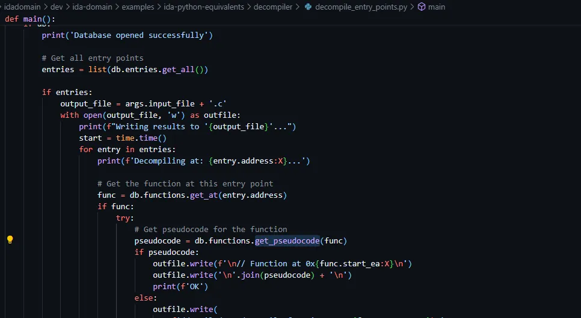

调用 Functions 提供的  `get_pseudocode`接口

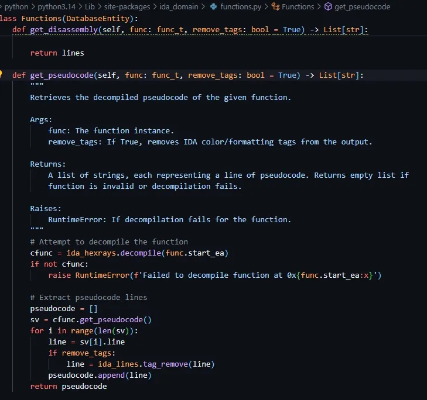


同样通过 `ida_hexrays.decompile`完成

**经过之前分析 ida 反编译是单线程进行的**

**`ida_hexrays.decompile`调用IDA脚本时，默认且通常是执行在单线程也即IDA程序的主线程中。**

**Hex-Rays decompiler  被设计在主线程分析上确保数据库中数据的一致性，因此你不需要采取任何特殊行为来强制单线程执行，这是默认和必须的行为。**

- **所有IDAPython与数据库交互时包括反编译，必须允许在IDA 主线程避免race conditions and data corruption**

上面黑体高亮的话是搜索得到，并未从代码中进行验证。下面我们从IDAPython 脚本接口分析，逐渐走到Low level分析原因。

### hexrays.pyd

pyd文件就是 hexrays 用c/c++ 编写的python扩展包，用于IDAPython调用

```
The ida_hexrays.pyd file is a Python extension module that exposes the Hex-Rays Decompiler API to IDAPython scripts and plugins
```

其中ida_hexrays.pyi  是静态类型文件

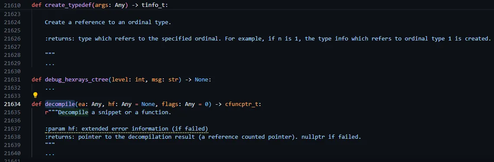

这里就有两种方式分析 hexrays.pyd库文件了

1. 学习pyi,pyd文件恢复出符号直接查找 decompile函数逆向
2. 搜索decompile字符串关键字，定位 decompile函数

笔者采用第二种方式。简单逆向发现，在反编译函数时 hexrays.pyd会判断是否是主线程，如果不是就返回。 

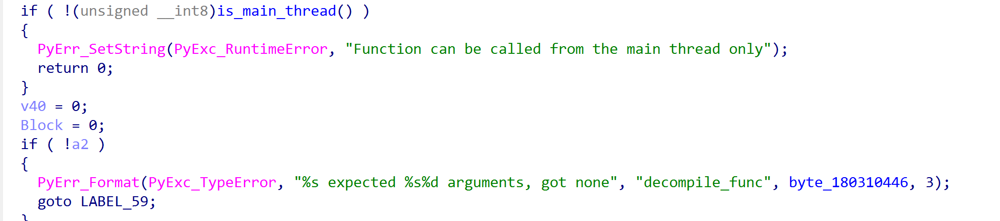


继续分析我们发现 hexrays.pyd  反编译过程调用  ida.dll/ida64.dll(old)    `get_hexdsp` 函数获取注册的回调函数

让我们重写梳理下调用流程

**我们发现 ida.dll 是 hexrays.pyd IDAPython插件和 hexx64 反编译插件共同的寄宿容器，通过全局变量执行**

**hexrays.decompile 最终也会调用 hexx64插件中的内部函数**  笔者这里符号化为 `task_dispatch` 


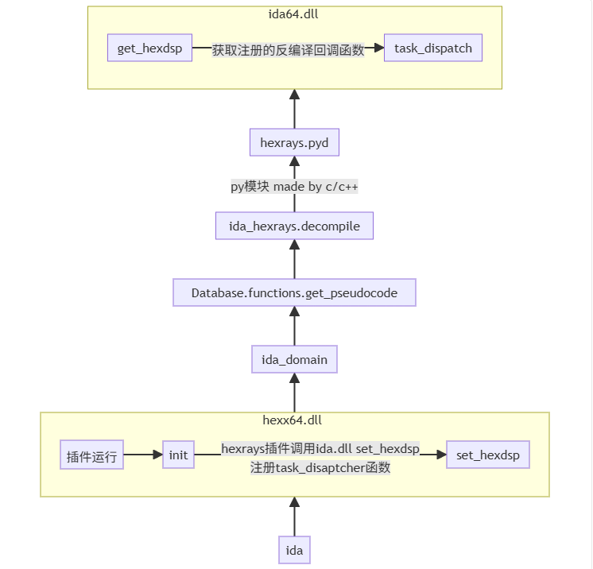

接下来我们跟进到hexx64 找到反编译函数内部，分析清楚为什么反编译函数不支持多线程。

### hexx64  IDA9.2

`The 64-bit decompiler's plugin name is not hexrays, it's not hexrays64 either. It is actually hexx64.dll`

通过对 `set_hexdsp`进行验证，确定 `sub_180216400`为之前的  task_dispatch函数

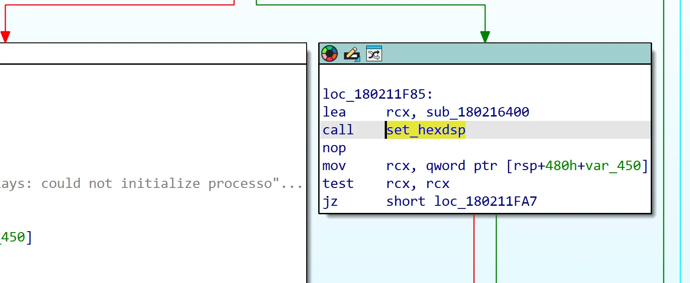

hexx64内部有反调试功能，禁止分析task_dispatch函数   

使用下面的命令bypass 检测，成功断到  hexx64!task_dispatch

> eb $peb+2 0

关于 DYLD Shared Cache Utils dscu 参考 [dscu](https://docs.hex-rays.com/user-guide/plugins/plugins-shipped-with-ida/dyld-shared-cache-utils)

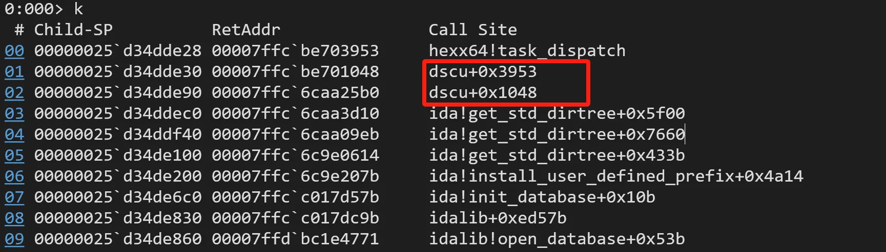


`task_dispatch` 函数原型如下: 

```c
__int64 __fastcall task_dispatch(
        int a1,
        __int64 *a2,
        __int64 a3,
        __int128 *a4,
        int *a5,
        _DWORD *a6,
        __int64 a7,
        __int64 a8,
        int a9);
```

通过对此函数进行trace  发现如下调用参数

```
rcx=00000000000000fc rdx=0000000000000002 r8=00007ffc7550fd7a r9=0000021950766cf0
00000025`d34ddd00  00000000`00000000 00007ffc`87a24314
00000025`d34ddd10  00000000`00000000 00000219`50782080
00000025`d34ddd20  00000000`00000000
rcx=00000000000000fc rdx=000000000000001f r8=00007ffc7550fd81 r9=0000021950766cf0
00000025`d34ddd00  00000000`00000000 00007ffc`87a24314
00000025`d34ddd10  00000000`00000000 00000219`50782080
00000025`d34ddd20  00000000`00000000
rcx=00000000000000fc rdx=0000000000000000 r8=00007ffc7550fdce r9=0000021950766cf0
00000025`d34ddd00  00000000`00000000 00007ffc`87a24314
00000025`d34ddd10  00000000`00000000 00000219`50782080
00000025`d34ddd20  00000000`00000000
rcx=00000000000000fc rdx=0000000000000004 r8=00007ffc7550fd74 r9=0000021950766cf0
00000025`d34ddd00  00000000`00000000 00007ffc`87a2432b
00000025`d34ddd10  00000000`00000000 00000219`50782080
00000025`d34ddd20  00000000`00000000
rcx=00000000000000fc rdx=0000000000000001 r8=00007ffc7550fdaa r9=0000021950766cf0
00000025`d34ddd00  00000000`00000000 00007ffc`87a2432b
00000025`d34ddd10  00000000`00000000 00000219`50782080
00000025`d34ddd20  00000000`00000000
rcx=00000000000000fc rdx=0000000000000002 r8=00007ffc7550fd7a r9=0000021950766cf0
00000025`d34ddd00  00000000`00000000 00007ffc`87a2432b
00000025`d34ddd10  00000000`00000000 00000219`50782080
00000025`d34ddd20  00000000`00000000
rcx=00000000000000fc rdx=000000000000001f r8=00007ffc7550fd81 r9=0000021950766cf0
00000025`d34ddd00  00000000`00000000 00007ffc`87a2432b
00000025`d34ddd10  00000000`00000000 00000219`50782080
00000025`d34ddd20  00000000`00000000
rcx=00000000000000fc rdx=0000000000000000 r8=00007ffc7550fdce r9=0000021950766cf0
00000025`d34ddd00  00000000`00000000 00007ffc`87a2432b
00000025`d34ddd10  00000000`00000000 00000219`50782080
00000025`d34ddd20  00000000`00000000
rcx=000000000000023e rdx=00007ffc87a262e0 r8=0000021950781fd8 r9=0000021950766cf0
00000025`d34ddd00  00000000`00000000 00007ffc`87a2433b
00000025`d34ddd10  00000000`00000000 00000219`50782080
00000025`d34ddd20  00000000`00000000
rcx=00000000000000cb rdx=0000021950781fe8 r8=00000025d34ddd30 r9=0000021950785020
00000025`d34ddd30  00000000`00000000 00000000`00000000
00000025`d34ddd40  00000219`50781f70 00000219`5077eaf0
00000025`d34ddd50  00088664`00004550
rcx=00000000000000cd rdx=0000021950781fe8 r8=000000000000000b r9=0000021950785020
00000025`d34ddd30  00000000`00000000 00000000`00000000
00000025`d34ddd40  00000219`50781f70 00000219`5077eaf0
00000025`d34ddd50  00088664`00004550
rcx=00000000000000cd rdx=0000021950781fe8 r8=0000000000000000 r9=00007ffdbdc81b3a
00000025`d34ddd30  00000000`00000000 00000000`00000000
00000025`d34ddd40  00000219`50781f70 00000219`5077eaf0
00000025`d34ddd50  00088664`00004550
rcx=00000000000000cd rdx=0000021950781fe8 r8=0000000000000002 r9=00007ffdbdc81b3a
00000025`d34ddd30  00000000`00000000 00000000`00000000
00000025`d34ddd40  00000219`50781f70 00000219`5077eaf0
00000025`d34ddd50  00088664`00004550
rcx=00000000000000cd rdx=0000021950781fe8 r8=0000000000000013 r9=00007ffdbdc81b3a
00000025`d34ddd30  00000000`00000000 00000000`00000000
00000025`d34ddd40  00000219`50781f70 00000219`5077eaf0
00000025`d34ddd50  00088664`00004550
rcx=00000000000000cd rdx=0000021950781fe8 r8=0000000000000014 r9=00007ffdbdc81b3a
00000025`d34ddd30  00000000`00000000 00000000`00000000
00000025`d34ddd40  00000219`50781f70 00000219`5077eaf0
00000025`d34ddd50  00088664`00004550
rcx=00000000000000cd rdx=0000021950781fe8 r8=0000000000000015 r9=00007ffdbdc81b3a
00000025`d34ddd30  00000000`00000000 00000000`00000000
00000025`d34ddd40  00000219`50781f70 00000219`5077eaf0
00000025`d34ddd50  00088664`00004550
rcx=00000000000000cd rdx=0000021950781fe8 r8=0000000000000016 r9=00007ffdbdc81b3a
00000025`d34ddd30  00000000`00000000 00000000`00000000
00000025`d34ddd40  00000219`50781f70 00000219`5077eaf0
00000025`d34ddd50  00088664`00004550
rcx=00000000000000cd rdx=0000021950781fe8 r8=0000000000000003 r9=00007ffdbdc81b3a
00000025`d34ddd30  00000000`00000000 00000000`00000000
00000025`d34ddd40  00000219`50781f70 00000219`5077eaf0
00000025`d34ddd50  00088664`00004550
rcx=00000000000000cd rdx=0000021950781fe8 r8=0000000000000006 r9=00007ffdbdc81b3a
00000025`d34ddd30  00000000`00000000 00000000`00000000
00000025`d34ddd40  00000219`50781f70 00000219`5077eaf0
00000025`d34ddd50  00088664`00004550
rcx=00000000000000cd rdx=0000021950781fe8 r8=0000000000000009 r9=00007ffdbdc81b3a
00000025`d34ddd30  00000000`00000000 00000000`00000000
00000025`d34ddd40  00000219`50781f70 00000219`5077eaf0
00000025`d34ddd50  00088664`00004550
rcx=00000000000000cd rdx=0000021950781fe8 r8=0000000000000008 r9=00007ffdbdc81b3a
00000025`d34ddd30  00000000`00000000 00000000`00000000
00000025`d34ddd40  00000219`50781f70 00000219`5077eaf0
00000025`d34ddd50  00088664`00004550
rcx=00000000000000cd rdx=0000021950781fe8 r8=000000000000000a r9=00007ffdbdc81b3a
00000025`d34ddd30  00000000`00000000 00000000`00000000
00000025`d34ddd40  00000219`50781f70 00000219`5077eaf0
00000025`d34ddd50  00088664`00004550
rcx=00000000000000cd rdx=0000021950781fe8 r8=000000000000006c r9=00007ffdbdc81b3a
00000025`d34ddd30  00000000`00000000 00000000`00000000
00000025`d34ddd40  00000219`50781f70 00000219`5077eaf0
00000025`d34ddd50  00088664`00004550
rcx=00000000000000cd rdx=0000021950781fe8 r8=000000000000006e r9=00007ffdbdc81b3a
00000025`d34ddd30  00000000`00000000 00000000`00000000
00000025`d34ddd40  00000219`50781f70 00000219`5077eaf0
00000025`d34ddd50  00088664`00004550
rcx=00000000000000c7 rdx=0000021950782008 r8=0000000000000001 r9=00007ffdbdc81b3a
00000025`d34ddd00  00000000`0000006e 00007ffc`87a243c8
00000025`d34ddd10  00000000`000000cd 00000219`50781fe8
00000025`d34ddd20  00000000`0000006e
ModLoad: 00007ffc`ac780000 00007ffc`ac7d1000   E:\tools\IDA9.2-home\plugins\gdb_user.dll
ModLoad: 00007ffc`bc1e0000 00007ffc`bc20f000   E:\tools\IDA9.2-home\plugins\goomba.dll
ModLoad: 00007ffc`68280000 00007ffc`6918e000   E:\tools\IDA9.2-home\libz3.dll
//  获取ida hexrays version
rcx=00000000000001b3 rdx=0000000000dec0de r8=00007ffc75280000 r9=00000025d34ddd28
*** WARNING: Unable to verify checksum for E:\tools\IDA9.2-home\plugins\goomba.dll
00000025`d34ddd40  00007ffc`6e2d200b 00000219`5077f160
00000025`d34ddd50  00000000`00000000 00000000`00000000
00000025`d34ddd60  00000000`00000110
rcx=000000000000023e rdx=00007ffcbc1e2750 r8=00000219507cb770 r9=00000219507cb860
00000025`d34ddd40  00007ffc`6e2d200b 00000219`5077f160
00000025`d34ddd50  00000000`00000000 00000000`00000000
00000025`d34ddd60  00000000`00000110
rcx=000000000000023e rdx=00007ffcbd9b1be0 r8=0000000000000000 r9=00000025d34dde98
*** WARNING: Unable to verify checksum for E:\tools\IDA9.2-home\plugins\hexraysidaplus.dll
00000025`d34ddeb0  00000219`5077de20 00007ffc`6caa25dc
00000025`d34ddec0  00007ffc`75496400 00000000`00000000
00000025`d34dded0  00000219`5077de20
... module load ...

//  decompile ... 
rcx=0000000000000236 rdx=00000025d34ded38 r8=0000000000000000 r9=0000000000000000
*** WARNING: Unable to verify checksum for E:\tools\IDA9.2-home\python\lib-dynload\_ida_hexrays.pyd
00000025`d34dece0  00000219`4bc51330 00007ffc`759e642d
00000025`d34decf0  00000219`507083f0 00000200`00000000
00000025`d34ded00  00000000`00000000
rcx=00000000000000d5 rdx=0000021950781fe8 r8=0000000000000005 r9=000002195082e8f0
00000025`d34de540  00000000`00000000 00000000`00000000
00000025`d34de550  00000000`00000000 00007ffc`75490b62
00000025`d34de560  00000219`5076ad50
rcx=0000000000000230 rdx=000002195082ea60 r8=0000000000000010 r9=0000000000000004
00000025`d34ded20  00000000`00000159 00000000`00001d19
00000025`d34ded30  ad27fecb`fb499d19 00000000`00001fff
00000025`d34ded40  00000219`49e0a590
rcx=00000000000000d5 rdx=0000021950781fe8 r8=000000000000000d r9=00000025d34de790
00000025`d34de640  00000000`00000000 00000000`00000000
00000025`d34de650  00000000`00000000 00007ffc`75490b62
00000025`d34de660  00000219`5076ad50
rcx=00000000000000d5 rdx=0000021950781fe8 r8=0000000000000016 r9=000002195082ea60
00000025`d34de5a0  00000000`00000000 00000000`00000000
00000025`d34de5b0  00000000`00000000 00007ffc`75490b62
00000025`d34de5c0  00000219`5076ad50
rcx=00000000000000d5 rdx=0000021950781fe8 r8=000000000000000e r9=0000021950833150
00000025`d34de6e0  00007ffc`88eb13b0 00000000`00000000
00000025`d34de6f0  00000000`00000000 00007ffc`75490b62
00000025`d34de700  00000219`5076ad50

... decompile a different function     rcx 参数序列

0x236 0xd5 0x230 0xd5 0xd5 0xd5

// 两个 0x23f结束
rcx=000000000000023f rdx=00007ffcbd9b1be0 r8=0000000000000000 r9=00000219507c1e80
00000025`d34de730  00000000`00000000 00000000`00000000
00000025`d34de740  00000000`00000000 00000000`00000000
00000025`d34de750  00000000`00000000
rcx=000000000000023f rdx=00007ffc87a262e0 r8=0000021950781fd8 r9=0000021949eeb9c0
00000025`d34de6d0  00000219`4808a340 00007ffc`87a25f77
00000025`d34de6e0  00000219`4808a340 00000000`00000000
00000025`d34de6f0  00000000`00000000
```

`hexx64!task_dispatch` 函数有 621个分支，最开始笔者以为反编译函数需要拆分为这么多分步骤

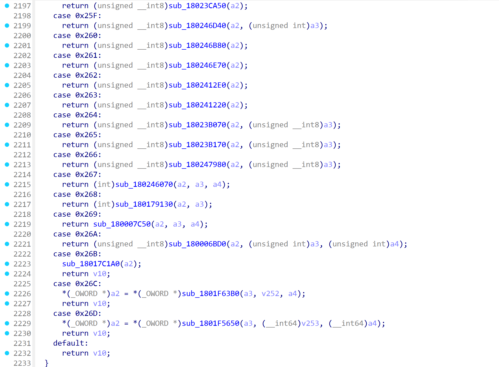


反编译函数 rcx参数为 0x236， 笔者这里符号化为 `decompile_top`  和`decompile_internals `  

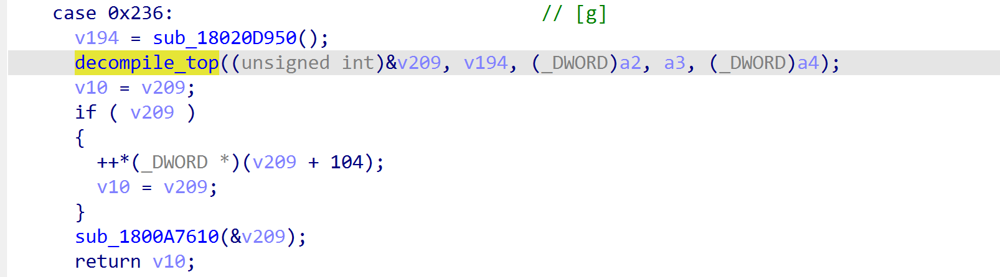

```c
__int64 __fastcall decompile_top(__int64 a1, __int64 a2, int a3, int a4, int a5)
{
  decompile_internals(*(_QWORD *)(a2 + 96), a1, a3, a4, 0, 0, a5, 9);
  return a1;
}
```

我们跟进 `decompile_internals` 函数，第一个不支持反编译并发的线索出现了。

**hexrays 插件在开发期间基本功能之一是考虑授权，并且hexrays decompiler具备UI，是一种QT插件。写过UI开发的都有过这种经历即 UI响应或交互与后端数据绑定关系，这种耦合性约束了反编译函数并行操作:)**  

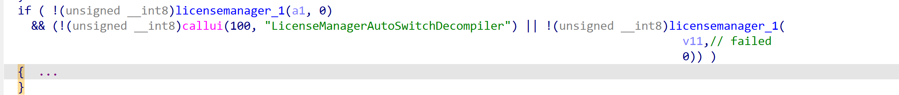


第二个问题或者线索给了笔者这样一个启示：

函数反编译不支持并发，单独反编译一个函数，基于func chunk或基本块的并行反编译也不支持，但是从理论上是可以支持的

我们注意 ida_hexrays.decomile注释有这样一句话:  `Decompile a snippet or a function`  

从最初构想上支持反编译一块代码片段，最终将这些snippet 伪代码通过AST 组装起来形成一个完整函数的伪代码

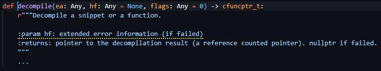

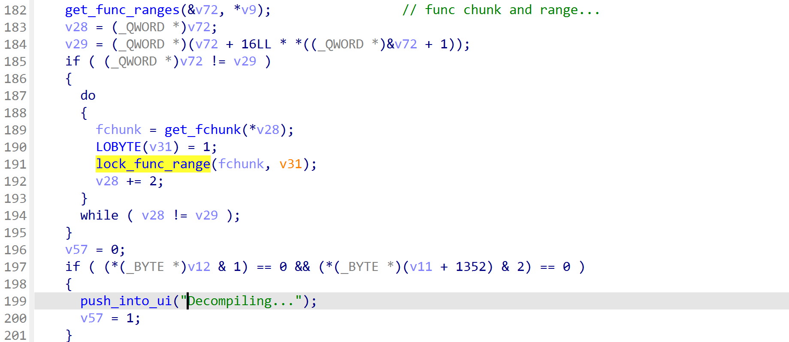


第三个线索是 反编译阶段是线性的，最重要的是需要与IDA数据库 [netnode](https://cpp.docs.hex-rays.com/classnetnode.html) 进行交互

比如 `handle_microcode` 处理microcode代码函数    Pseudocode 和 microcode都会存储在数据库中， hex-rays 插件与数据库的耦合性也导致了支持并发的困难性增大。

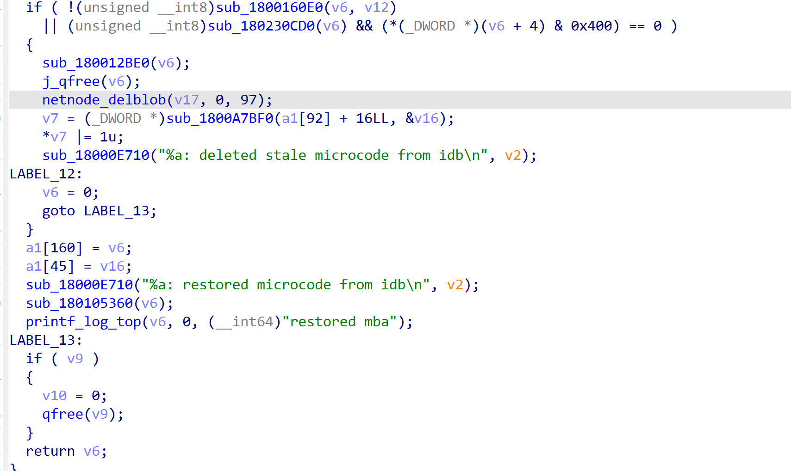


我们整理下论据:

1. hexrays 插件在开发阶段早期需要与IDA 主界面进行交互，响应。这种耦合性导致了授权逻辑和反编译逻辑无法切割开，不支持反编译并行
2. microcode 生成，预处理和反编译过程的线性化设计思想老旧，没有CPU Pipeline 预测优化概念导致整个反编译过程缓慢。
3. hexrays 插件需要将Pseudocode 和 microcode写入数据库，IDA的 netnode数据库在设计期是为IDA 主界面UI服务的，当并行时可能破坏数据一致性，导致反编译并行几乎难以实现。
4. 最重要的是  hexrays decompile插件由  @ilfak 一人开发; 笔者对比了IDA9.0, 9.1,9.2 几乎没有任何改动。


## headless in ida_domain?

第二个问题是 在ida_domain python包中直接调用 headless脚本

`Database` 类提供了 `execute_script` 接口 可以直接调用，ida_domain api较以往使用确实方便和简单多。

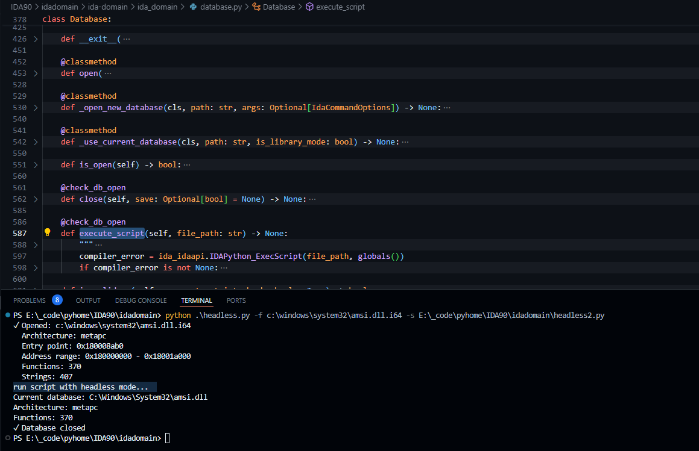


## Disable plugin load based on Policy when headless?

是否支持基于策略禁用插件加载呢？

阅读了ida_domain代码，目前尚不支持，等pr吧。


