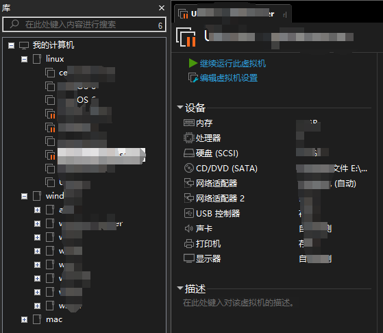
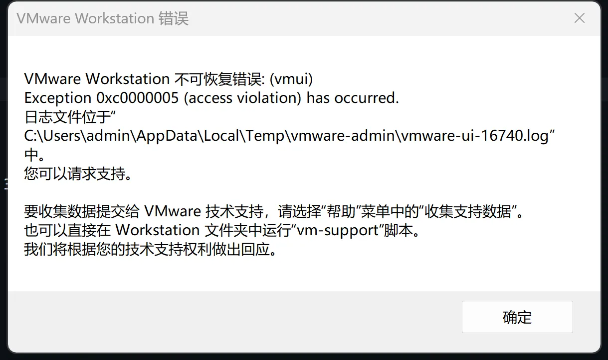
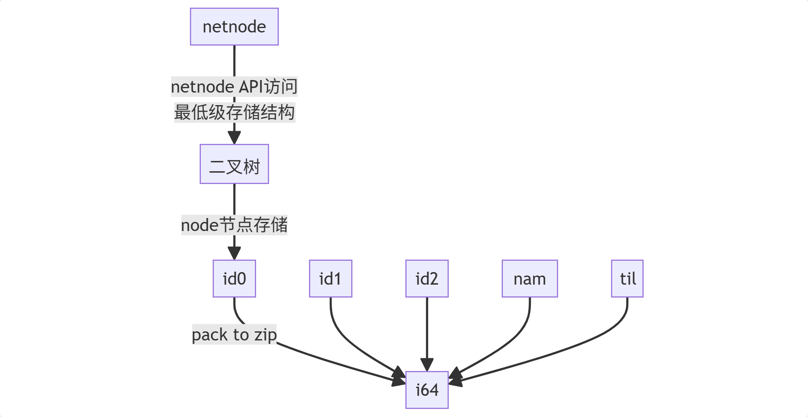
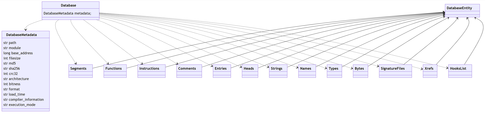
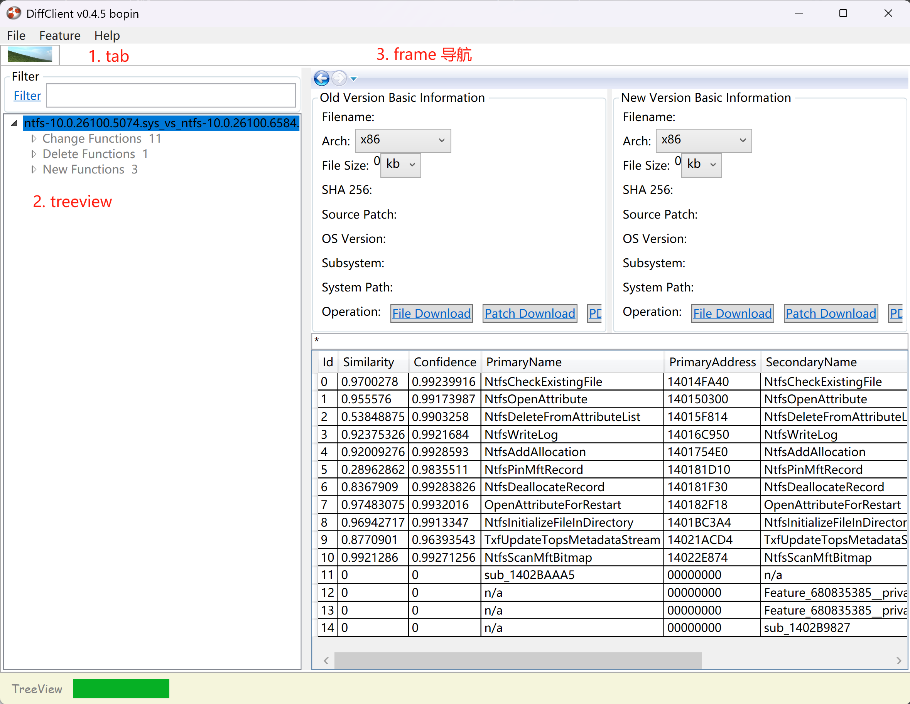
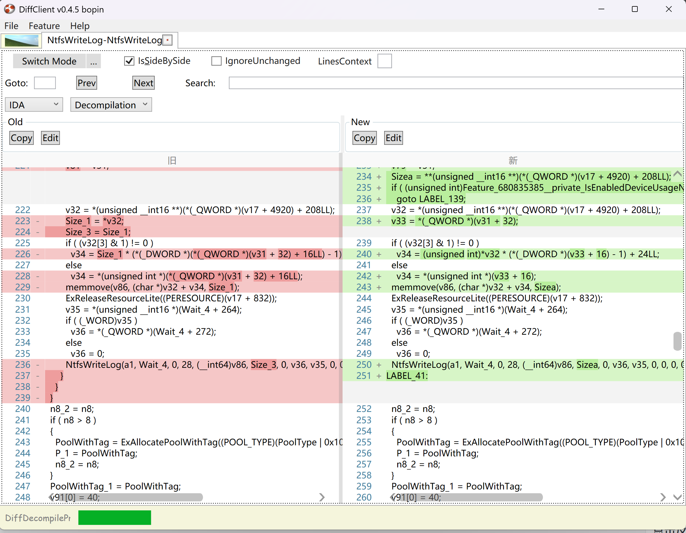
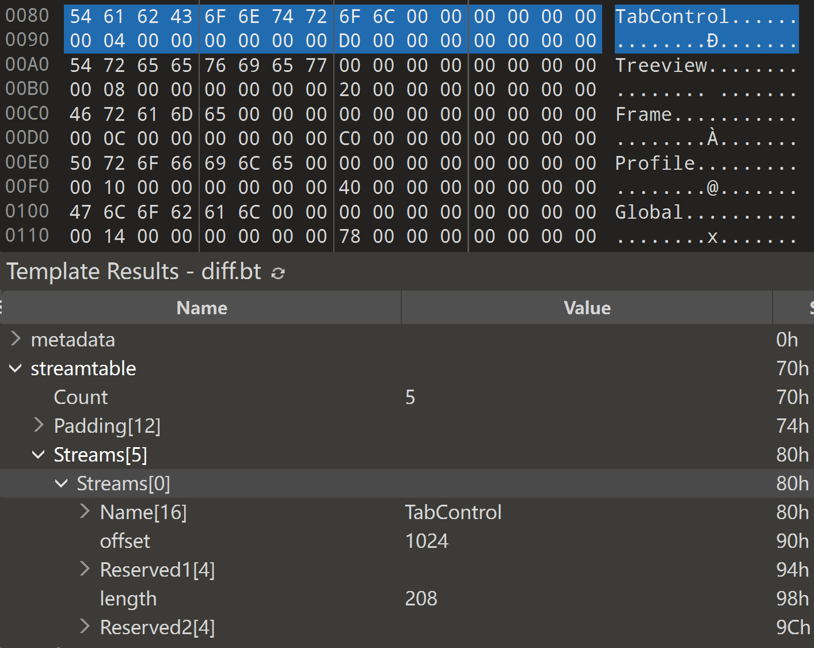
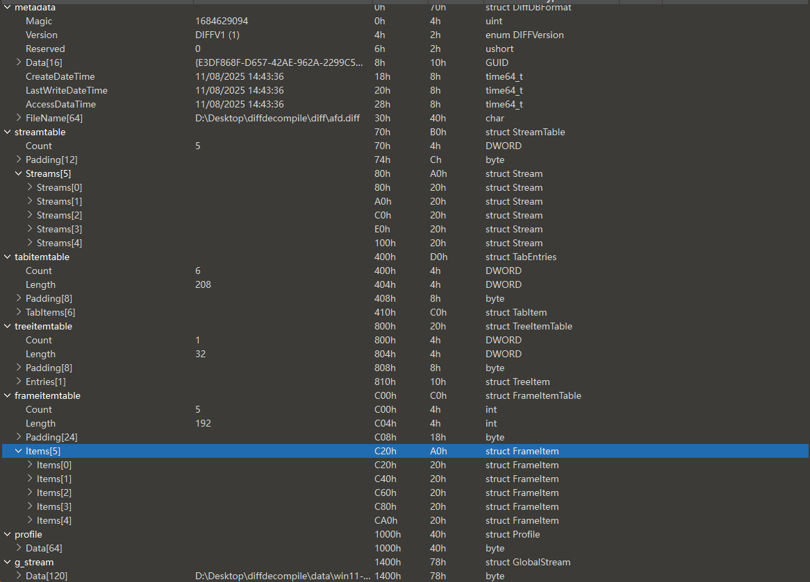

过去一段时间对Diff进行了一些工作。它的工作原理是基于ida headless自动化比对二进制程序，将结果按照特定文件格式写入保持下来，客户端通过`DiffClient` .NET WPF编写的工具进行可视化查看。

在最开始使用时，它表现良好。随着对结果分析，渐渐地一个需求随之而来--UI的状态保存和恢复（IDA数据库那样打开可以恢复到上次停留的地方）这个想法最开始两年前已经存在于潜意识之中，我想该是完成这个小挑战了。

我会详细介绍我是如何思考这个问题的，如何设计一套目前并不完美的文件协议格式以及我的开发过程和未来的改进工作。

最开始，我只有一个想法就是想要实现这个功能。除此之外，毫无头绪。稍微不恰当的说有点好高骛远，但是将时间周期拉长这些都显得微不足道。你真正想做的事情，神也挡不住。于是我制定了详细的计划，将这个任务拆解为以下几个分步骤：

1. 观察常用的软件并检索能够符合需求的软件并把它们整理出来
2. 学习它们的设计方式和实现原理（可以阅读文档，开源代码，逆向等等）
3. 开始尝试自己设计，包括仔细分析自己的工具都需要保存什么信息，这决定了你的保存协议是什么方式
4. 编写库代码和单元测试
5. UI工具引入此库进行状态保存和恢复


## who shoud I imitate?

在常用的软件中我们可以参考的有很多，比如vmware, ida, chrome 还有各种IDE工具

笔者这类挑选vmware 和 ida简述。除了工具角度，我们还可以从公开的文件协议格式去参考 比如 [PDB symbol file format](https://llvm.org/docs/PDB/index.html)

## designing after demands

### vmware

我注意到，打开vmware workstation时会将工作区和tab页面进行恢复



vmware workstation 通过一组配置文件和内部数据库保存 工作状态。 关闭主窗口时，这些信息被持久化；再次打开窗口时，读取信息 rebuild之前的状态。

主配置保存在  `C:\Users\<user>\AppData\Roaming\VMware\preferences.ini`

工作区状态，树状结构保存在 `C:\Users\<user>\AppData\Roaming\VMware\inventory.vmls`

tab标签页的状态持久化需要考虑以下几点：

1. tab 标签页数目和item 元素信息 （count不能溢出）
2. 标记当前默认选择的tab页面
3. 系统默认内置的tab页面  比如 home, localhost  (这种style 类似浏览器中的  chrome://  自定义url协议) 

标识 tab count数目，每个tab 包含名称，类型等

```
pref.ws.session.window0.tab.count = "1"
pref.ws.session.window0.tab0.dest = ""
pref.ws.session.window0.tab0.file = ""
pref.ws.session.window0.tab0.type = "home"
pref.ws.session.window0.tab0.cnxType = "vmdb"
pref.ws.session.window0.tab0.focused = "TRUE"
```

树状结构本质上是通过一组线性数据表达结构化状态。这里需要考虑的东西就很少了，tree结构只需要把node 与 parent node表达出来就可以了

可以通过字符串，整数表达。此外，树状结构状态可能还需要固定，置顶操作，以及node 顺序的概念

我们来看下 vmware是如何实现的:

vmware 使用三种符号表达

`ParentID` 表示Parent ID 

`ItemID` 表示当前ID

`SeqID` 表示顺序ID

```
vmlist72.ParentID = "0"			// ParentID 为0，表示这是根节点下的node
vmlist72.ItemID = "72"			// ItemID 为72
vmlist72.SeqID = "3"			// 根节点下的 第三个node
```

在对其进行研究的过程中，尝试将 ParentID 设置为不存在的ItemID 会导致当前node 自动归属到根节点下

可是，如果将ParentID  设置为本身是 node 并非文件夹这种的容器，就会导致下面错误



文件夹的创建基于以下符号实现

```
vmlist74.config = "folder74"
vmlist74.Type = "2"
vmlist74.DisplayName = "windows"
vmlist74.ParentID = "0"
vmlist74.ItemID = "74"
vmlist74.SeqID = "1"
vmlist74.IsFavorite = "FALSE"
vmlist74.UUID = "folder:52 b1 bb c3 1a 4b 94 0b-fe 6c 18 28 1a 72 cc 07"
vmlist74.Expanded = "FALSE"
```

node 创建

```
vmlist71.config = "xxx.vmx"
vmlist71.DisplayName = "xxx"
vmlist71.ParentID = "0"
vmlist71.ItemID = "71"
vmlist71.SeqID = "63"
vmlist71.IsFavorite = "FALSE"
vmlist71.IsClone = "FALSE"
vmlist71.CfgVersion = "8"
vmlist71.State = "normal"
vmlist71.UUID = ""
vmlist71.IsCfgPathNormalized = "TRUE"
```

最后，通过`ParentID`符号支持树节点嵌套下去

我们简单总结下

1. vmware 保存了树状结构和tab页面信息（仅从UI元素工作区来看，这是客观需求)  所表达的信息逻辑上较为简单，vmware因此使用文本文件类似ini配置进行表示
2. tab页面区分内置tab页面和自定义选项卡创建
3. 树状结构主要解决 node父子关系，文件夹容器和普通节点以及其他属性来丰富描述信息比如 `IsFavorite` 表达虚拟机的特别关注 `DispalyName` 描述名称。

这种方式是基于vmware workstation未来页面几乎不变并且可以基于配置添加属性进行扩展，因此较为简单。但是这种组织方式不适合`DiffClient` 

### ida 

随后我检阅了IDA的数据库  ida本质是一个压缩包，打开数据库时解压缩为若干文件，数据库存储基于二叉树，ida然后在之上封装了 [netnode](https://cpp.docs.hex-rays.com/classnetnode.html) 抽象层。



通过阅读 [ida_domain](https://github.com/HexRaysSA/ida-domain/tree/main/ida_domain) 源码，可以看到ida 数据库中都存在什么信息，基于此，参考阶段基本可以结束了



ida 数据库抽象了 `DatabaseEntity` 这个概念，所有的函数，指令，注释，字符串等都继承此对象，并且作为二进制格式还需要元数据头 `DatabaseMetadata` 。 当我们对工具的实际功能理解足够时，创建其状态和恢复就和序列化/反序列化对象一致。

下面笔者会从分析自身工具的功能开始，简单设计存储协议。

## DiffClient

首先`DiffClient` 从功能分为三个功能区



tab页面还可能展示 diffview  用来查看指定函数的伪代码情况




* tab页面需要恢复工具每次打开固定的`root` 或 `home` 页面还有diffview
* treeview 需要保存node上下文信息，包括父子逻辑关系这部分可以借鉴vmware ParentID，其他属性比如是否展开`Change Functions` `Delete Functions` `New Functions`  这三者是描述发生修改的函数块，新增和删除的
* frame 区域当点击tree node时触发不同的显示，具备导航功能，因此我们需要存储其顺序信息

## development

首先我们设计二进制文件格式时，需要先定义Metadata 元数据或文件头 （笔者这里使用C#语言来表述  对齐方式使用 LayoutKind.Sequential）

`DiffDBFormat` 包含固定的magic  字符串`diff` 的16进制（小端序格式）, 2字节版本，16字节的GUID进行标识数据库唯一性，接下来三者是时间戳信息考虑到创建数据库和打开数据库操作，最后是当前数据库名称 0x40字节

```c#
// 0x70
internal struct DiffDBFormat
{
    public uint Magic;
    
    public ushort Version;

    public byte[] Data;   // guid
    
    public long CreateDateTime;
    
    public long LastWriteDateTime;
    
    public long AccessDataTime;

    public string FileName;
}
```


接下来如何定义呢？ 笔记基于`DiffClient` 功能区 `tab` `treeview` `frame` 采用类似 PDB格式中Stream的概念来描述（感谢pdb file format） 它的优势在于pdb 文件格式是一个内置的文件系统，单个stream可以视作一个新的文件格式，通过偏移和长度信息可以表述的数据和信息不一定是连续的。仔细想想NTFS文件系统使用 B-树存储数据，这种优势兼容性也很好。因此我们还需要 offset,length属性

笔者这里添加了两个新的Stream  `Profile` 当前数据库的配置Stream 和 `Global` Stream来描述全局的数据区

stream name长度最大为0x10字节  描述stream的名称；offset 表明实际stream内容的偏移地址, length表示stream的长度。 整个结构体对齐0x20

```c#
// 0x20
internal struct stream
{
    public char[] name;		
    public int offset;
    public int length;
}
```

streams  表示Stream table 可以存储不限制个数的Stream， 它的结构很简单，一个字段表示数量，之后便是stream信息

为了保持兼容性 Count字段之后以 0x10对齐。  stream真正的数据 0x400对齐

```c#
internal struct streams
{
	public int Count;			// offset 0x00   padding 0xc
    public stream[] stream;		// stream align 0x20
}
```

这里可以看到 `TabControl` stream 的内容在偏移 0x400处，长度为 208



接下来是 tabcontrol stream里面存储的信息应该是什么，这具体取决于我们分析功能阶段 tab页面应该具备什么   按照一般逻辑 tab页面需要名称，类型; 因为tab 还会表达 diffview 信息，因此还需要存储与 diff的函数单元相关的信息。这里我的分析逻辑是通过 diffview 函数单元来自于那个.diffdecompile 即treeview上第几个node，然后是该diff单元下第几个函数

```c#
internal struct tab_entry
{
    public string name;
	public int type;
    public ushort TreeEA;
    public ushort FunctionEA;
}
```

```c#
internal struct tab_entries
{
    public int count;
    public tab_entry[] entries;
}
```

其他的 treeview和frame也同样如此  整体结构是  一个表结构存储stream 元信息，真实的数据根据 stream表中的 offset和length 存储在非连续内存数据中； 这种方式的优点是  stream真实数据的地方也是一个新的文件格式可以嵌套，扩展性非常好。

```
[metadata]
[stream table]

...
[stream1]
	[substream metadata]
	[substream table]
	...
	[substream1]
	...
	[substream2]

...
[stream2]
	[substream metadata]
	[substream table]
	...
	[substream1]
	...
	[substream2]
```

对于其他 stream的结构我们完全不需要太在意，因为当我们按照这种方式组织结构时后续的修改和扩展是非常方便的


笔者这里使用 010Editor写了个解析模板

```c
//------------------------------------------------
//--- 010 Editor v11.0.1 Binary Template
//
//      File: diff.bt
//   Authors: bopin
//   Version: 0.0.1
//   Purpose: Parse DiffDecompile DB for state resotre
//  Category: Executable
// File Mask: *.diff
//  ID Bytes: diff
//   History: 
//   v0.0.1 2025-11-07 bopin: Private release
//   support DiffTree Flag bits symbolization
//   support FILETIME Parsing
//
//
//
//------------------------------------------------

LittleEndian();

Printf("diff.bt begin\n");

void error_message(string msg) {
    Warning(msg);
    Printf(msg + "\n");
}

typedef enum<USHORT>
{
    DIFFV1 = 0x0001,
}DIFFVersion;

typedef enum<USHORT>
{
    DiffRoot = 0,
    DiffChange = 1,
    DiffDelete = 2,
    DiffNew = 3,
} FrameType;

typedef enum<BYTE>
{
    RootExpanded = 0x01,
    ChangeExpanded = 0x02,
    DeleteExpanded = 0x04,
    NewExpanded = 0x08
}ExpandState <edit=flags,format=hex>;

typedef struct
{
    int offset;
    int length;
    ExpandState expand_state;
    byte padding[0x7];
}TreeItem;

typedef struct
{
    DWORD Count;
    DWORD Length;
    byte Padding[0x8];
    TreeItem Entries[Count];
}TreeItemTable;

typedef struct
{
    char Name[0x10];
    int Type;
    WORD TreeEA;
    WORD FunctionEA;
    byte Padding[0x8];
} TabItem;

typedef struct
{
    USHORT TreeIndex;
    FrameType TreeIndexType;
    USHORT TreeIndexFuncIndex;
    byte Padding[0x1a];
}FrameItem;

typedef struct
{
    int Count;
    int Length;
    byte Padding[0x18];
    FrameItem Items[Count];
}FrameItemTable;

typedef struct
{
   DWORD Count;
   DWORD Length;
   byte Padding[0x8];
   TabItem TabItems[Count] <optimize=false>;   
} TabEntries;

typedef struct
{
    char Name[0x10];
    int offset;
    byte Reserved1[0x4];
    int length;
    byte Reserved2[0x4];
} Stream;

typedef struct
{
    DWORD Count;
    byte Padding[0xc];
    Stream Streams[Count] <optimize=false>;
} StreamTable;

typedef struct
{
    byte Data[0x40];
}Profile;

typedef struct(int length)
{
    byte Data[length];
}GlobalStream;

typedef struct
{
    uint Magic;
    DIFFVersion Version;
    ushort Reserved;
    GUID Data;
    time64_t  CreateDateTime;
    time64_t LastWriteDateTime;
    time64_t AccessDataTime;
    char FileName[0x40];
} DiffDBFormat;


DiffDBFormat metadata;
StreamTable streamtable;
for(WORD i =0; i < streamtable.Count; i++)
{
    Printf("%s %d %d\n", streamtable.Streams[i].Name,streamtable.Streams[i].offset,streamtable.Streams[i].length);
} 
// parse tabitem
FSeek(streamtable.Streams[0].offset);
TabEntries tabitemtable;

// parse tree
FSeek(streamtable.Streams[1].offset);
TreeItemTable treeitemtable;

// parse frame
FSeek(streamtable.Streams[2].offset);
FrameItemTable frameitemtable;

// parse profile
FSeek(streamtable.Streams[3].offset);
Profile profile;

// parse global data
FSeek(streamtable.Streams[4].offset);
GlobalStream g_stream(streamtable.Streams[4].length);

Printf("parse finished\n");
```




我们看下部分伪代码

```c#
public DiffDBMetadata Deserialize(MemoryStream stream)
{
    if(stream == null) throw new ArgumentNullException("stream");
    if (!stream.CanRead) { throw new EndOfStreamException("cannot read"); }
    DiffDBMetadata ddb = new DiffDBMetadata();
    ddb.Magic = stream.ReadUInt();
    ddb.Version = (DiffVersion)stream.ReadUShort();
    stream.ReadPaddingBytes(4);
    ddb.Data = stream.ReadGuid().ToByteArray();
    ddb.CreateDateTime = stream.ReadLong();
    ddb.LastWriteDateTime = stream.ReadLong();
    ddb.AccessDataTime = stream.ReadLong();
    ddb.FileName = stream.ReadString();
    return ddb;
}

public byte[] Serialize(DiffDBMetadata obj)
{
    using (var ms = new MemoryStream())
    {
        ms.WriteUInt(obj.Magic);
        ms.WriteUShort((ushort)obj.Version);
        ms.WriteBytes(0x00, 2);
        ms.Write(obj.Data);
        ms.WriteLong(obj.CreateDateTime);
        ms.WriteLong(obj.LastWriteDateTime);
        ms.WriteLong(obj.AccessDataTime);
        ms.WriteString(obj.FileName);
        int rest = 0x40 - obj.FileName.Length;
        if (rest > 0)
        {
            ms.WriteBytes(0x00, rest);
        }
        return ms.ToArray();
    }
}
```

stream table

```c#
public DiffDBStreamTable Deserialize(MemoryStream stream)
{
    if (stream == null) throw new ArgumentNullException("stream");
    if (!stream.CanRead) { throw new EndOfStreamException("cannot read"); }
    DiffDBStreamTable dbTable = new DiffDBStreamTable();
    dbTable.Count = stream.ReadInt();
    dbTable.Length = stream.ReadInt();
    stream.ReadPaddingBytes(0x8);
    dbTable.Streams = new DiffDBStream[dbTable.Count];
    // iterator deserialize stream table items
    for (int i = 0; i < dbTable.Count; i++)
    {
        DiffDBStream ddb = new DiffDBStream();
        byte[] buffer = new byte[0x20];
        stream.Read(buffer, 0, buffer.Length);
        dbTable.Streams[i] = ddb.Deserialize(buffer);
    }
    return dbTable;
}

public byte[] Serialize(DiffDBStreamTable obj)
{
    using (var ms = new MemoryStream())
    {
        ms.WriteInt(obj.Count);
        ms.WriteInt(obj.Length);
        ms.WriteBytes(0x00, 0x8);
        // iterator serialize stream table items
        foreach (var item in obj.Streams)
        {
            ms.Write(item.Serialize(item));
        }
        return ms.ToArray();
    }
}
```


## use

在我们完成单测和库代码封装后，将其引入到`DiffClient`工具中

```c#
// 实例化 reader对象
DiffDBReaderManager dbm = new DiffDBReaderManager(_fileName);
var mt = dbm.GetMetadata(out _);
// 验证 metadata magic
if(mt.Magic != 0x64696666)
{
    throw new Exception("invalid diff db file format");
}
// 解析各种stream
var st = dbm.GetStreamTable();
var tt = dbm.GetTabItemTable(st);
var treett = dbm.GetTreeItemTable(st);
var ft = dbm.GetFrameItemTable(st);
var profile = dbm.GetProfileData(st);
// 将stream中的数据和UI对象对应起来
initializeTreeView(dbm,st, treett);
initializeTabItem(tt, st);
initializeFrame(dbm,st,ft);

// 从 DiffDBStreamTable 中解析数据
private void initializeTreeView(DiffDBReaderManager dbm, DiffDBStreamTable st, DiffDBTreeItemTable tree)
{
    foreach (DiffDBTreeItem item in tree.TreeItems)
    {
        // 从 Global Stream中根据offset,length 获取数据
        string filename = Encoding.UTF8.GetString(dbm.GetDataFromGlobalStream(st, item.Offset, item.Length));
        if (File.Exists(filename))
        {
            DBTreeitemContext context = new DBTreeitemContext();
            context.State = (ExpandState)item.ExpandState;
            // 将恢复的数据和UI对应起来
            _mainWindow.AddDiffDecompileToTreeViewFromDB(filename, context, cache: false);
        }
    }
}
```


## demo
<video controls width="100%">
	<source src="../videos/state_restore_demo.mp4" type="video/mp4">
</video>


## future

通过上面的简述，首先基本完成了功能需求。在我看来，最为难的是分析清楚UI功能和需求，只有将现有的功能和未来可能出现的功能理解足够，设计的协议格式才能抗打，健壮性更强。第二个困难是将文件协议数据和UI关联起来，一个tab页面可以通过1,2,3来表示，也可以用一个结构体来表示，只要协议能够充分表达UI对象即可。

未来的工作是优化api使用，使其使用更简化，并且具备读写文件。

根据UI功能修改文件格式，添加字符串比对，ETW Descriptor (Windows文件)


## reference

* https://www.sweetscape.com/010editor/manual/IntroTempScripts.htm
* https://llvm.org/docs/PDB/index.html


