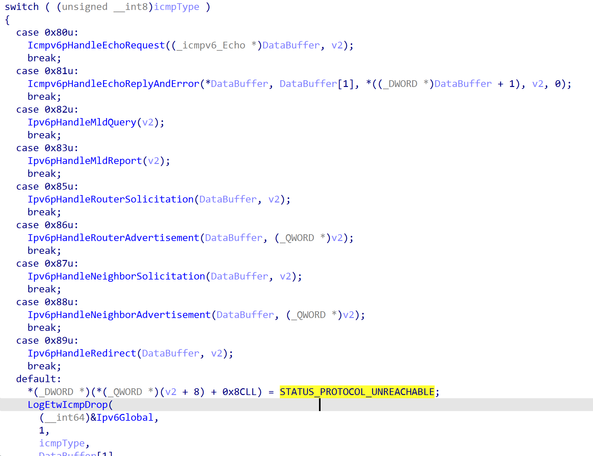
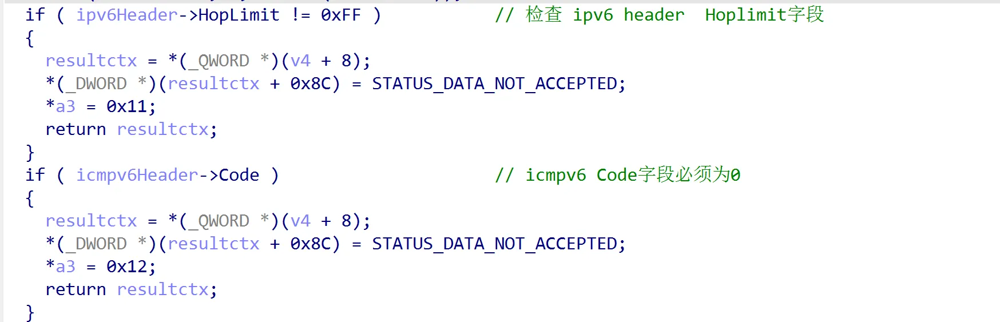
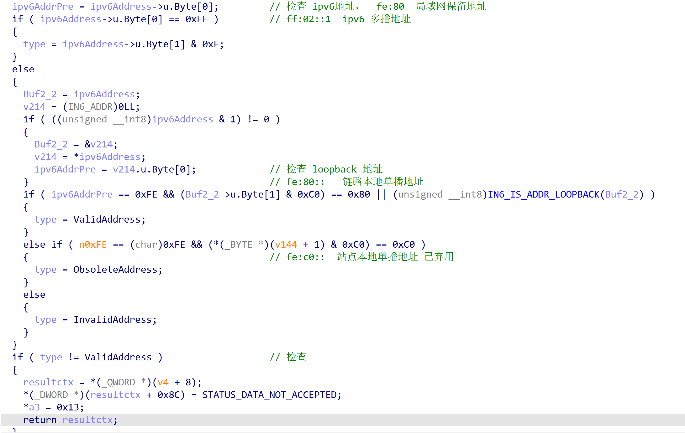
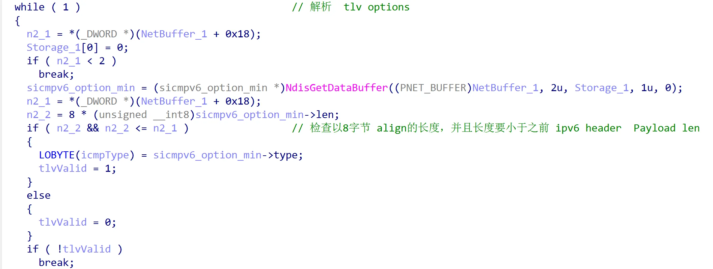
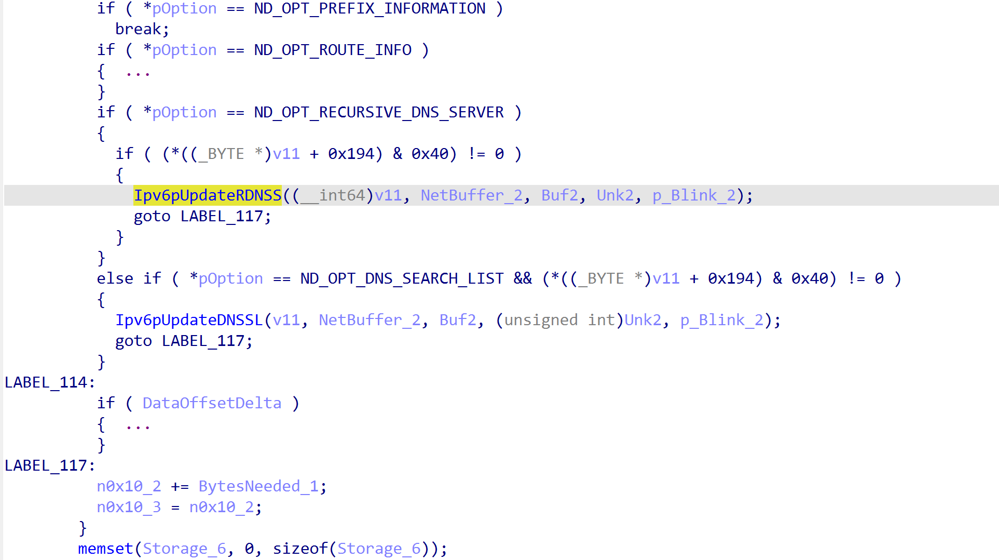
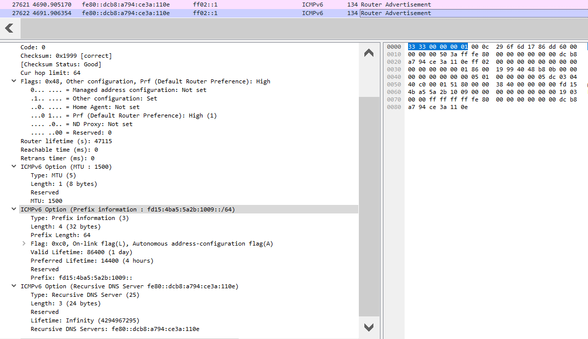
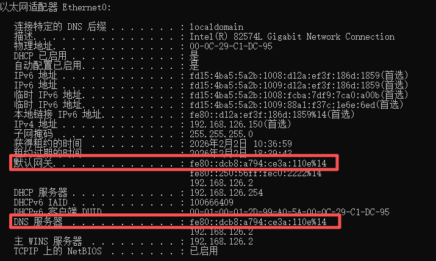

# overview

​        过去一段时间，我投入了一些精力复现  [TheWizards](https://x.com/ESETresearch/status/1917542183223124286)  [1](https://www.welivesecurity.com/en/eset-research/thewizards-apt-group-slaac-spoofing-adversary-in-the-middle-attacks/) 使用IPv6 SLAAC 劫持软件更新技术。由于工作需要，我被迫开始了从仅存的文章和部分样本开始研究分析。然而，这篇文章我并不想讨论过多技术细节。我相信，每位安全研究人员都能够稳定复现这种技术。在这里，我想讨论的是这种技术在攻击链上所处的角色，它的适用条件是什么，以及当前软件的整体安全生态问题，最后给我们的启发意义。

​       出于私心，我想这项研究可以辅助对Windows 漏洞网络协议栈的了解（事实上，这些努力的确做到了）。在我复现RDNSS过程中，对Windows协议栈的支持情况进行逆向，能够更好的理解现代化网络协议的局限性和MS对此所作的努力。第二个私心是满足个人的兴趣。我也的确想看看APT所用的技术是否真的出神入化。

备注:  笔者在编写本文时，默认读者具备一定的网络，IPv6知识储备，故而对相关概念不提供指导。


# You Should Know Where You Are

考虑这样一种场景：  攻击者拿下了一台主机/路由器，想要横向移动到另一台主机上。不考虑漏洞的情况下，也不存在任何凭据, 如何得到这台主机的权限呢？`TheWizards`  通过 ipv6  slaac ，rdnss 技术强制设置目标机器的网关地址指向自身，目标机器的DNS地址指向自身可控的地址。在这种条件下，目标机器的流量就会由攻击者接管（MITM）。通过劫持DNS协议，响应恶意的ip地址，当软件更新以http协议请求更新包时，就有可能完成远程代码执行。这里需要满足的条件有3个： http协议（本质上是返回内容攻击者可控）;  软件自更新 (软件老版本会选择打开网页，也可以基于这种方式制作钓鱼网页)，安装程序时会执行新的安装包;  hash校验和签名校验绕过（对返回内容缺乏严格校验的软件更易受到攻击）。

上面的描述相当清楚了。IPv6 SLAAC RDNSS 欺骗技术完成了劫持目标流量这一环节，对于目标机器上软件更新以达到代码执行的目的这一环节攻击面 "似乎" 看上去非常多了。 至少我们可以自己编写一个程序，执行更新功能，以http协议请求资源，解压缩后直接运行就达到目的了。武器化这项技术到这里就结束了？

有关IPv6 SLAAC 技术滥用参考 rfc文档: [rfc4861](https://www.rfc-editor.org/rfc/pdfrfc/rfc4861.txt.pdf)  [rfc4443](https://www.rfc-editor.org/rfc/pdfrfc/rfc4443.txt.pdf)  [rfc5006](https://www.rfc-editor.org/rfc/pdfrfc/rfc5006.txt.pdf)  [rfc8106](https://www.rfc-editor.org/rfc/pdfrfc/rfc8106.txt.pdf)


# Step Into The Next Step

现在，我们稍稍介绍下 ICMPv6协议  Windows网络协议栈的实现

## Icmpv6ReceiveDatagrams

`tcpip!Icmpv6ReceiveDatagrams`  负责接收ICMPv6 报文并且根据 ICMPv6 Header 首字节Type进行解析  相关结构如下

```c
enum _icmp_type{
    EchoPingRequest		= 128,
    EchoPingReply		= 129,
    RouterSolicatation	= 133,
    RouterAdvertisement = 134,
    NeighborSolicitation = 135,
    NeighborAdvertisement = 136,
    MulticastListenerReportMessagev2 = 143,
}icmp_type;

enum _icmp_option_type{
    SourceLinkLayerAddress = 1,		// icmp请求原主机ip的Mac地址
    TargetLinkLayerAddress = 2,		// icmp请求指定ip的Mac地址
}icmp_option_type;

struct _icmp_option{
    icmp_option_type Type;
    byte	Length;
    long long LinkLayerAddress;		// 8字节Mac地址
}icmp_option;

struct _icmpv6{
    byte Type;		// 表明ICMPv6的实际包类型
    byte Code;		
    short Checksum;
    int Flags;
    ipv6_address TargetAddress;
    icmp_option Option;
}icmpv6;
```





## Ipv6pHandleRouterAdvertisement

通过逆向 tcpip.sys (10.0.17763.292) 协议栈  `Ipv6pHandleRouterAdvertisement` 分析RA包

其算法如下：

1. 检查 Ipv6 Header字段 Hop Limit, 必须等于0xff；检查 icmpv6 header  Code字段 必须为0
2. 检查 Ipv6 地址，第一个字节如果是  0xff, 检查第二个字节按位与 0xf 结果必须是2，否则返回失败。Type为2是本地链路上的地址，因此RDNSS技术仅能用于本地链路，局域网传播。

​       如果地址首字节不为 0xff, 判断 fe80  为本地链路地址， 如果是 fec0 表明已经弃用, 然后检查ipv6地址类型是否有效（等于2）

3. 检查 ipv6 header  Payload Length字段，必须大于或等于 0x10

4. 经过一系列检查后，现在开始解析 TLV  Icmpv6  Option扩展数据;  循环每两字节解析 option， 检查以8字节 align的长度，并且长度要小于之前 ipv6 header  Payload len； 如果有一个Option解析失败则退出循环

5. 根据 option 首字节的type 执行对应的代码








```c
struct __unaligned sicmpv6_option_min
{
      __int8  type;
      __int8 len;
};
```




解析 ICMPv6  Option可选字段




更新当前DNS 服务器地址


## Bingo!

假设现在通过 ICMPv6 Router Advertisement (RA) 包控制了目标主机网关和DNS地址







# Where Are We Arrived?

现在让我们重新看看我们处在四个阶段的哪一部分？

* IPv6 SLAAC 攻击链角色   （劫持流量技术前奏）
* 劫持软件更新需满足的条件  
* 软件更新的安全生态
* 启发思考

ok，前面笔者简述了劫持软件更新需要满足的条件。现在，让我们回归现实。测试并验证实际软件的更新逻辑安全性如何。

## Come down to earth

笔者目前测试了几种软件更新，抽象后会形成如下结论 (笔者仍能感知到结论的不完备性，如有需求后续会继续更新) :

软件更新大体分为两类：

1. http

​       直接使用http下载 安装执行代码（直接可以利用）

2. https

- 使用https 访问，但是没有对网站证书进行校验，攻击者可以伪造一个正常合法的https server （https://sslsky.com/），仍然可控返回内容； 并且缺乏对返回内容进行hash 和 签名校验  （可以直接利用）
- 攻击者无法控制返回内容，同时客户端代码对返回内容有hash 和 签名校验

在笔者测试过程中，有相当一部分软件的更新逻辑如下：

1. 使用 https从域名A 请求下载配置文件（xml/json）包含下载链接和hash
2. 使用 http 下载更新包，hash验证后执行安装

对于这种更新逻辑由于无法篡改或恶意响应第一部分的配置文件，指向攻击者构造的下载链接，同时也无法绕过签名和hash校验，因此目前来看，这种是无能为力的。百度网盘，QQ，Edge更新都是这样。

在笔者编写这篇文章时 (2026-02-02)  Notepad++ 也遭遇了更新劫持。[@cyb3rops](https://x.com/cyb3rops/status/2018253965645766993)    [hijacked-incident-info-update](https://notepad-plus-plus.org/news/hijacked-incident-info-update/)        [notepad++ v8.8.9 ](https://notepad-plus-plus.org/news/v889-released/)   [patch commit](https://github.com/notepad-plus-plus/wingup/commit/ce0037549995ed0396cc363544d14b3425614fdb)

Notepad++ v8.8.9 before 更新程序 `WinGUp` 存在逻辑漏洞缺陷，导致攻击者可以劫持流量，返回恶意内容，由于对返回内容校验不严格，导致被攻击者利用。

| 协议                                 | 软件                                                         | 备注                                   |
| ------------------------------------ | ------------------------------------------------------------ | -------------------------------------- |
| http                                 | process hacker <br> MS crypt service 证书更新                | crypt service 解析cab 缺乏代码执行功能 |
| https                                | systeminfomer  配置文件json，强制使用https<br>meitu          |                                        |
| https 下载配置文件<br>http  下载文件 | baidunetdisk,  qq, edge   验证签名和hash<br>notepad++  v8.8.9之前没有验证 xml签名和文件hash<br> |                                        |

现在让我们对当前软件更新逻辑安全生态做出一些回答。一般情况下，开发者早期实现功能时并没有考虑这么严谨的防劫持功能，大多数都是被在野利用，厂商开始修复。比如早期QQ升级存在逻辑漏洞 [QQ update](https://www.secrss.com/articles/13054)   根据这种模式，宏观上看，整体的软件更新逻辑走的还不算太监控，勉勉强强奔小康...   假如引入一些限定条件，比如软件开发一般通过设置或配置文件，定期自动更新，这类功能良好完备的软件开发团队安全性方面考虑更可靠一些。手动检查更新的软件，从历史上看，有可能已经停止维护，老版本软件被利用的风险极大的提高了。因此，笔者认为，仅就这项功能而言，风险或攻击面还是不小的。


# We Are Offensive RedTeamer

上面我们从攻击链以及实施攻击所需的条件，然后谈论当前软件的安全生态。对于防御者而言，开发人员的安全意识取决于均衡教育的影响。在同一时期，所产生的代码从某种程度上存在相似的漏洞模式（不论是逻辑漏洞还是二进制漏洞）。

现在让我们将思路重新切回红队人员，解构整个攻击链。

攻击链  =  某项劫持技术(IPv6 SLAAC) 达到劫持目标流量的条件   +    篡改响应内容（更新包推送木马） +   软件更新（利用自身功能 ShellExecute，完成代码执行）

让我们将视角移动到最后一个环节：  这项攻击技术从当前来看是利用了软件更新的逻辑缺陷，本质是属于利用漏洞造成代码执行-客户端代码执行。我们之前在对Windows客户端进行逆向过程中，其实也发现同样的代码风格。客户端对从服务器接收到的数据校验不正确，产生溢出等等。尽管二进制漏洞利用成功难度较大，但是也不失为一种方式。

# reference

1. https://www.welivesecurity.com/en/eset-research/thewizards-apt-group-slaac-spoofing-adversary-in-the-middle-attacks/
1. https://medium.com/@cihananthony/spellbinding-the-network-replicating-thewizards-apt-style-ipv6-attack-for-red-team-operations-d1a2edca4c72


